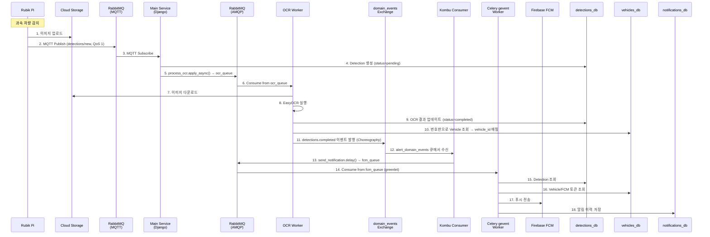
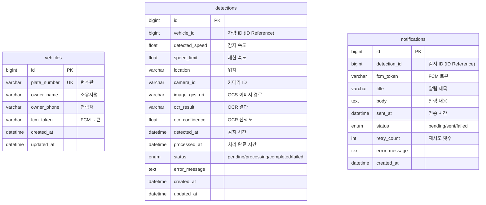

# 과속 차량 감지 및 알림 시스템 — Backend

### Software Design Document

| 항목 | 내용 |
|------|------|
| **Authors** | 이상훈 (Backend Lead / DevOps) |
| **Status** | Living Document |
| **Last Updated** | 2026-02-19 |
| **Repository Scope** | Django API, Celery Worker 소스코드, Dockerfile, 로컬 개발 환경 |

---

## 목차

1. [배경 및 범위](#1-배경-및-범위-context--scope)
2. [목표 및 비목표](#2-목표-및-비목표-goals--non-goals)
3. [시스템 아키텍처](#3-시스템-아키텍처-system-architecture)
4. [상세 설계](#4-상세-설계-detailed-design)
5. [대안 분석](#5-대안-분석-alternatives-considered)
6. [공통 관심사](#6-공통-관심사-cross-cutting-concerns)
7. [기술 스택](#7-기술-스택)
8. [프로젝트 구조](#8-프로젝트-구조)
9. [로컬 개발 환경](#9-로컬-개발-환경)
10. [성능 및 부하 테스트](#10-성능-및-부하-테스트)
11. [팀](#11-팀)
12. [관련 문서](#12-관련-문서)
13. [변경 이력](#13-변경-이력)

---

## 1. 배경 및 범위 (Context & Scope)

Qualcomm 기반 Rubik Pi 엣지 디바이스에서 YOLO 객체 감지와 속도 측정을 통해 과속 차량을 탐지하고, Google Cloud Storage에 이미지를 업로드한 뒤 MQTT 프로토콜로 서버에 전송한다. 서버는 EasyOCR로 번호판을 인식하고, 매칭된 차량 소유자에게 Firebase Cloud Messaging 푸시 알림을 전송한다.

이 문서는 **백엔드 시스템**의 설계를 다룬다. 엣지 디바이스(Rubik Pi)와 프론트엔드(React)는 범위에 포함하지 않는다.

### 저장소 책임 범위

| 항목 | 이 저장소 (backend) | deploy 저장소 |
|------|:---:|:---:|
| 애플리케이션 소스코드 | O | X |
| Dockerfile (3개) | O | X |
| 로컬 개발 docker-compose | O | X |
| GitHub Actions CI | O | X |
| 프로덕션 compose / 배포 | X | O |
| 프로덕션 모니터링 설정 | X | O |

---

## 2. 목표 및 비목표 (Goals & Non-Goals)

### Goals

- **Event-Driven Architecture (Choreography Pattern)** 으로 서비스 간 느슨한 결합 달성
- **MQTT 프로토콜**로 IoT 디바이스 통신 최적화 (경량, QoS 1, At-least-once)
- 서비스별 **독립 배포 및 수평 확장** 가능한 구조
- **Database per Service** 패턴으로 데이터 격리 및 장애 전파 차단
- OpenTelemetry 기반 **분산 트레이싱, 메트릭, 로그** 관측성 확보
- Dead Letter Queue를 통한 **메시지 유실 방지** 및 장애 복구

### Non-Goals

- 엣지 디바이스(Rubik Pi) 소프트웨어 설계
- 프론트엔드(React) 설계
- Kubernetes 기반 오케스트레이션 (현재 Docker Compose 기반)
- 실시간 영상 스트리밍
- Multi-region 배포

---

## 3. 시스템 아키텍처 (System Architecture)

### 3.1 아키텍처 진화: Before → After

기존 모놀리식 구조에서 발견된 4가지 핵심 문제를 해결하기 위해 Event-Driven Architecture로 전환했다.

| 영역 | Before | After |
|------|--------|-------|
| **OCR 처리** | Django 동기 (블로킹) | OCR Worker 비동기 (Celery prefork) |
| **응답 시간** | 3초+ | < 100ms |
| **IoT 프로토콜** | HTTP (오버헤드) | MQTT (경량, QoS 1) |
| **메시지 보장** | 없음 | At-least-once |
| **장애 격리** | 전체 영향 | 컴포넌트 격리 |
| **확장성** | 서버 전체 확장 | Worker별 독립 확장 |
| **데이터베이스** | 단일 DB | 서비스별 4개 DB |
| **Alert 처리** | Celery 직접 호출 (Orchestration) | Kombu Consumer + Celery gevent (Choreography) |

> 📸 캡처 1. 시스템 전체 아키텍처 다이어그램 (Before vs After)

### 3.2 인스턴스 배포 구조

6개의 GCE 인스턴스로 구성되며, 모두 `asia-northeast3-a` 리전에 배치된다.

```
┌──────────────────────────────────────────────────────────────────────┐
│                       GCP (asia-northeast3-a)                        │
├───────────┬───────────┬───────────┬───────────┬───────────┬─────────┤
│  app      │  db       │  mq       │  ocr      │  alert    │  mon    │
│           │           │           │           │           │         │
│  Django   │  MySQL 8  │  RabbitMQ │  Celery   │  Kombu    │  Prome- │
│  Gunicorn │  4 DBs    │  MQTT     │  prefork  │  Consumer │  theus  │
│  MQTT Sub │           │  AMQP     │           │  + Celery │  Grafana│
│           │           │           │           │  gevent   │  Loki   │
│           │           │           │           │           │  Jaeger │
└───────────┴───────────┴───────────┴───────────┴───────────┴─────────┘
```

| 인스턴스 | 역할 | 주요 컴포넌트 |
|----------|------|--------------|
| `speedcam-app` | API 서버 + 이벤트 수신 | Django, Gunicorn, MQTT Subscriber |
| `speedcam-db` | 데이터베이스 | MySQL 8.0 (4개 DB) |
| `speedcam-mq` | 메시지 브로커 | RabbitMQ (MQTT Plugin + AMQP) |
| `speedcam-ocr` | OCR 처리 | Celery Worker (prefork pool) |
| `speedcam-alert` | 알림 처리 | Kombu Consumer + Celery Worker (gevent pool) |
| `speedcam-mon` | 모니터링 | Prometheus, Grafana, Loki, Jaeger |

### 3.3 End-to-End 데이터 흐름



---

## 4. 상세 설계 (Detailed Design)

### 4.1 메시징 아키텍처

두 가지 프로토콜을 목적에 따라 분리하여 사용한다.

| 프로토콜 | 용도 | 특징 |
|----------|------|------|
| **MQTT** (Port 1883) | IoT → Main Service (`detections/new`) | 경량, QoS 1, Choreography 이벤트 전파 |
| **AMQP** (Port 5672) | Task 분배 + 도메인 이벤트 | Exchange/Queue 라우팅, DLQ 지원 |

#### Exchange 설계

| Exchange | Type | Routing Key | 용도 |
|----------|------|-------------|------|
| `ocr_exchange` | direct | `ocr` | OCR Task 라우팅 |
| `fcm_exchange` | direct | `fcm` | 알림 Task 라우팅 |
| `domain_events` | topic | `detections.completed` | 도메인 이벤트 (Choreography) |
| `dlq_exchange` | fanout | - | Dead Letter 처리 |

#### Queue 설계

| Queue | Exchange | DLQ | TTL | Max Priority | Prefetch |
|-------|----------|:---:|:---:|:---:|:---:|
| `ocr_queue` | ocr_exchange | ✅ | 1h | 10 | 1 |
| `fcm_queue` | fcm_exchange | ✅ | 1h | - | 10 |
| `alert_domain_events` | domain_events | ✅ | - | - | 1 |
| `dlq_queue` | dlq_exchange | - | - | - | 1 |

- `ocr_queue`: Prefetch 1 — CPU 집약적 OCR은 한 번에 하나씩 처리
- `fcm_queue`: Prefetch 10 — I/O 대기 시간을 활용하여 다수 메시지 프리페치

### 4.2 서비스별 설계

#### Main Service (`speedcam-app`)

```
[Gunicorn]                     [MQTT Subscriber]
workers=${GUNICORN_WORKERS}    백그라운드 스레드 (blocking loop)

REST API 처리                   detections/new 수신
- 과속 내역 조회                  → Detection pending 레코드 즉시 생성
- 차량 등록/조회                  → process_ocr.apply_async()
- 알림 이력 조회
```

- Django + Gunicorn (`workers=${GUNICORN_WORKERS:-4}`, `threads=${GUNICORN_THREADS:-2}`)
- MQTT Subscriber: `paho-mqtt` 기반, 별도 스레드에서 `loop_forever()` 실행
- `detections/new` 수신 시 즉시 `Detection(status=pending)` 레코드 생성 → 데이터 손실 방지
- OTel instrumented (`speedcam-main`)

#### OCR Service (`speedcam-ocr`)

- Celery **prefork** pool (`concurrency=${OCR_CONCURRENCY:-2}`)
- CPU-bound 작업: GCS 다운로드 → EasyOCR + OpenCV → 번호판 파싱
- 처리 완료 후 `domain_events` exchange에 `detections.completed` 발행 (Choreography)
- Mock 모드 지원 (`OCR_MOCK=true`)
- OTel instrumented (`speedcam-ocr`)

#### Alert Service (`speedcam-alert`) — 2개 프로세스 구조

```
┌─────────────────────────────┐    ┌──────────────────────────────────┐
│  프로세스 1: Kombu Consumer  │    │  프로세스 2: Celery gevent Worker │
│  단일 스레드                  │    │  --pool=gevent                   │
│                              │    │  --concurrency=${ALERT_CONCURRENCY}│
│  domain_events exchange에서  │    │                                   │
│  detections.completed 구독   │    │  send_notification 태스크 처리     │
│                              │    │  greenlet 100개 동시 FCM 전송     │
│  → send_notification.delay() │──→│  (I/O-bound 병렬 처리)            │
│    (즉시 반환, 비동기)        │    │                                   │
│                              │    │                                   │
│  OTel: speedcam-alert-       │    │  OTel: speedcam-alert             │
│         consumer             │    │                                   │
└─────────────────────────────┘    └──────────────────────────────────┘
```

- `start_alert_worker.sh`에서 두 프로세스를 `trap` 기반으로 lifecycle 관리
- **필수 환경변수**: `OTEL_PYTHON_AUTO_INSTRUMENTATION_EXPERIMENTAL_GEVENT_PATCH=patch_all`
  - OTel auto-instrumentation이 gevent monkey-patching보다 먼저 로드되면 Django DB thread-safety 이슈 발생
  - 이 환경변수로 OTel 초기화 전에 `gevent.monkey.patch_all()` 수행
  - 상세 분석: [docs/GEVENT_DB_THREAD_SAFETY.md](docs/GEVENT_DB_THREAD_SAFETY.md)
- Mock 모드 지원 (`FCM_MOCK=true`)

### 4.3 데이터베이스 설계 (Database per Service)

MSA 환경에서 각 서비스는 독립적인 데이터베이스를 사용하여 느슨한 결합을 유지한다.

| 서비스 | 데이터베이스 | 용도 |
|--------|-------------|------|
| Django Core | `speedcam` | Auth, Admin, Sessions, Celery Results |
| Vehicles | `speedcam_vehicles` | 차량 정보, FCM 토큰 |
| Detections | `speedcam_detections` | 과속 감지 내역, OCR 결과 |
| Notifications | `speedcam_notifications` | 알림 전송 이력 |

- **ForeignKey 대신 ID Reference**: MSA 원칙에 따라 cross-DB FK 관계를 사용하지 않음
- **Django Database Router** (`config/db_router.py`): `app_label` 기반 자동 라우팅, `allow_relation = False`



```
┌─────────────────┐     ID Reference      ┌─────────────────┐
│  vehicles_db    │ ◄───────────────────── │  detections_db  │
│  Vehicle        │    vehicle_id          │  Detection      │
└─────────────────┘                        └────────┬────────┘
                                                    │ ID Reference
                                                    │ detection_id
                                           ┌────────▼────────┐
                                           │notifications_db │
                                           │  Notification   │
                                           └─────────────────┘
```

### 4.4 Celery 설정

| 설정 | 값 | 이유 |
|------|-----|------|
| `task_serializer` | json | 범용성, 디버깅 용이 |
| `timezone` | Asia/Seoul | 한국 시간대 기준 |
| `task_acks_late` | True | Worker 비정상 종료 시 메시지 재전달 |
| `task_reject_on_worker_lost` | True | Worker 소실 시 메시지 reject → DLQ |
| `task_time_limit` | 300s | Hard timeout |
| `task_soft_time_limit` | 240s | Soft timeout (SoftTimeLimitExceeded) |
| `worker_prefetch_multiplier` | 1 | 공정한 분배 |

Task 라우팅:

| Task | Queue | Exchange |
|------|-------|----------|
| `tasks.ocr_tasks.process_ocr` | `ocr_queue` | `ocr_exchange` |
| `tasks.notification_tasks.send_notification` | `fcm_queue` | `fcm_exchange` |
| `tasks.dlq_tasks.process_dlq_message` | `dlq_queue` | `dlq_exchange` |

---

## 5. 대안 분석 (Alternatives Considered)

### 5.1 Choreography vs Orchestration

| 항목 | Choreography (선택) | Orchestration |
|------|:---:|:---:|
| **구조** | 각 서비스가 자율적으로 동작 | 중앙 Orchestrator가 제어 |
| **결합도** | 느슨한 결합 ✅ | 강한 결합 |
| **확장성** | 서비스별 독립 확장 ✅ | Orchestrator 병목 가능 |
| **장애 격리** | 영향 최소 ✅ | 중앙 장애 시 전체 중단 |
| **디버깅** | 흐름 추적 어려움 | 중앙 추적 용이 |

**선택 이유**: 각 인스턴스(Main, OCR, Alert)가 독립적으로 배포/확장되며, OCR Worker가 직접 DB를 업데이트하여 Main Service 병목을 제거한다. 흐름 추적의 어려움은 OpenTelemetry 분산 트레이싱으로 보완한다.

### 5.2 RabbitMQ vs Google Cloud Pub/Sub

| 항목 | RabbitMQ (선택) | Cloud Pub/Sub |
|------|:---:|:---:|
| **MQTT 지원** | Plugin으로 지원 ✅ | 미지원 (별도 브릿지 필요) |
| **지연 시간** | 낮음 (VPC 내부) ✅ | 상대적으로 높음 |
| **비용** | 인스턴스 비용만 ✅ | 메시지 수 기반 과금 |
| **Priority Queue** | 지원 ✅ | 미지원 |
| **관리 부담** | 직접 운영 필요 | 완전 관리형 |

**선택 이유**: Rubik Pi가 MQTT 프로토콜을 사용하므로 RabbitMQ MQTT Plugin으로 직접 연결할 수 있고, VPC 내부 통신으로 낮은 지연 시간을 확보한다.

### 5.3 prefork vs gevent Pool

| 항목 | prefork | gevent |
|------|---------|--------|
| **방식** | 멀티프로세싱 | 코루틴 (Greenlet) |
| **GIL 영향** | 회피 가능 ✅ | 영향 받음 |
| **적합한 작업** | CPU-bound ✅ | I/O-bound ✅ |
| **동시성** | 프로세스 수 제한 | 수천 개 가능 |

**적용 전략**:

| Worker | Pool | 이유 |
|--------|------|------|
| OCR Worker | `prefork` | EasyOCR은 CPU 집약적, GIL 회피 필요 |
| Alert Worker | `gevent` | FCM API 호출은 I/O 대기, 높은 동시성 필요 |

### 5.4 Single DB vs Database per Service

| 항목 | Single DB | Database per Service (선택) |
|------|:---:|:---:|
| **결합도** | 높음 (스키마 공유) | 낮음 ✅ |
| **독립 배포** | 어려움 | 가능 ✅ |
| **데이터 일관성** | 트랜잭션 보장 | 최종 일관성 |
| **조인 쿼리** | 가능 | 불가 (Application Join) |

**선택 이유**: MSA 원칙 준수로 서비스 간 느슨한 결합을 달성하고, 한 서비스의 DB 장애가 다른 서비스에 영향을 최소화한다.

---

## 6. 공통 관심사 (Cross-cutting Concerns)

### 6.1 관측성 (Observability)

| 영역 | 도구 | 용도 |
|------|------|------|
| **Metrics** | Prometheus + Grafana + cAdvisor | 시스템/컨테이너 메트릭 (11 targets) |
| **Logging** | Loki + Promtail v3.3.2 | 중앙 집중식 로그 수집 (16 containers) |
| **Tracing** | OpenTelemetry + Jaeger | 분산 트레이싱 (서비스 간 요청 추적) |
| **Task Monitoring** | Flower | Celery Task 상태 모니터링 |
| **Queue Dashboard** | RabbitMQ Management | Queue 상태 확인 |

> 📸 캡처 2. Grafana 대시보드 (시스템 메트릭 개요)

> 📸 캡처 3. Jaeger 트레이싱 (E2E 요청 추적 — MQTT 수신부터 FCM 전송까지)

> 📸 캡처 4. RabbitMQ Management (Queue 상태 및 메시지 처리량)

### 6.2 CI/CD

**CI** (이 저장소 — GitHub Actions):

| Workflow | 내용 |
|----------|------|
| `lint.yml` | flake8, black, isort 코드 품질 검사 |
| `test.yml` | pytest (main, ocr, alert 3개 워크플로우) |
| `docker-build.yml` | 3개 Docker 이미지 빌드 검증 |

- Trigger: `push` / `pull_request` to `develop`
- Python 3.12, pip cache 활용

**CD**: 별도 deploy 저장소에서 관리

### 6.3 데이터 손실 방지

- **MQTT QoS 1**: At-least-once 전달 보장
- **Pending 레코드 즉시 생성**: MQTT 메시지 수신 즉시 `Detection(status=pending)` 생성 → OCR 실패해도 감지 사실 추적 가능
- **Dead Letter Queue**: 실패한 메시지를 `dlq_queue`로 라우팅하여 별도 처리
- **Celery acks_late**: Worker 비정상 종료 시 메시지가 재전달됨
- **task_reject_on_worker_lost**: Worker 소실 시 메시지 reject → DLQ 전달

### 6.4 보안

- MQTT/AMQP 인증 필수 (`RABBITMQ_MQTT_ALLOW_ANONYMOUS=false`)
- GCP Service Account 기반 GCS/Firebase 인증
- `credentials/` 디렉토리 Git 제외 (`.gitignore`)
- CORS 설정으로 허용 Origin 제한
- Django `SECRET_KEY` 환경변수 관리

---

## 7. 기술 스택

| 구분 | 기술 | 버전 |
|------|------|------|
| Language | Python | 3.12 |
| Framework | Django | 5.1.7 |
| API | Django REST Framework | 3.15.2 |
| WSGI Server | Gunicorn | 23.0.0 |
| Task Queue | Celery | 5.5.2 |
| Message Broker | RabbitMQ | 3.13+ |
| RDBMS | MySQL | 8.0 |
| OCR Engine | EasyOCR | 1.7.2 |
| Image Processing | OpenCV | 4.10.0 |
| Object Storage | Google Cloud Storage | 2.18.2 |
| Push Notification | Firebase Admin SDK | 6.8.0 |
| Async Pool | gevent | 24.2.1 |
| Tracing | OpenTelemetry + Jaeger | - |
| Metrics | Prometheus + Grafana | - |
| Logging | Loki + Promtail | 3.3.2 |
| Container | Docker | 29.x |
| CI | GitHub Actions | - |

---

## 8. 프로젝트 구조

각 서비스는 동일한 코드베이스를 공유하되, 실행 시 역할에 따라 다른 컴포넌트만 활성화한다.

```
backend/
├── .github/workflows/          # CI (lint, test, docker-build)
│   ├── lint.yml
│   ├── test.yml
│   └── docker-build.yml
│
├── apps/                       # Django Apps (서비스별 독립 DB)
│   ├── vehicles/               # → vehicles_db
│   ├── detections/             # → detections_db
│   └── notifications/          # → notifications_db
│
├── config/                     # Django / Celery 설정
│   ├── settings/               # base.py, dev.py, prod.py
│   ├── celery.py               # Exchange / Queue / Routing 정의
│   ├── db_router.py            # MSA Database Router
│   ├── urls.py
│   └── wsgi.py
│
├── core/                       # 공통 모듈
│   ├── mqtt/                   # MQTT Subscriber / Publisher
│   │   ├── subscriber.py       # detections/new 수신 → Detection 생성 → OCR 발행
│   │   └── publisher.py        # 도메인 이벤트 발행 (detections/completed)
│   ├── events/                 # AMQP 도메인 이벤트
│   │   └── consumer.py         # Kombu Consumer (Alert Service용)
│   ├── gcs/                    # Google Cloud Storage 클라이언트
│   └── firebase/               # FCM 클라이언트
│
├── tasks/                      # Celery Tasks
│   ├── ocr_tasks.py            # process_ocr (OCR Service)
│   ├── notification_tasks.py   # send_notification (Alert Service)
│   └── dlq_tasks.py            # DLQ 메시지 처리
│
├── scripts/                    # 서비스 시작 스크립트
│   ├── start_main.sh           # Django + MQTT Subscriber
│   ├── start_ocr_worker.sh     # Celery prefork Worker
│   └── start_alert_worker.sh   # Kombu Consumer + Celery gevent Worker
│
├── docker/                     # Docker / 인프라 설정
│   ├── Dockerfile.main         # Main Service 이미지
│   ├── Dockerfile.ocr          # OCR Service 이미지
│   ├── Dockerfile.alert        # Alert Service 이미지
│   ├── docker-compose.yml      # 로컬 개발 환경
│   ├── mysql/
│   │   └── init.sql            # Multi-DB 초기화
│   ├── rabbitmq/
│   │   └── enabled_plugins     # MQTT Plugin 활성화
│   └── k6/                     # 부하 테스트 스크립트
│       └── mqtt-load-test.py
│
├── tests/                      # 테스트
│   ├── conftest.py
│   ├── unit/
│   └── integration/
│
├── docs/                       # 설계 문서
├── credentials/                # 인증 정보 (Git 제외)
├── requirements/               # 서비스별 의존성
│   ├── base.txt                # 공통
│   ├── main.txt                # Main Service
│   ├── ocr.txt                 # OCR Service
│   └── alert.txt               # Alert Service
│
├── manage.py
├── pytest.ini
└── backend.env.example         # 환경변수 템플릿
```

---

## 9. 로컬 개발 환경

### Quick Start

```bash
# 1. Clone
git clone <repo-url>
cd backend

# 2. 환경변수 설정
cp backend.env.example backend.env
# backend.env를 에디터에서 편집

# 3. Docker Compose 실행
cd docker
docker-compose up -d --build

# 4. 접속 확인
# API Server:       http://localhost:8000
# Swagger UI:       http://localhost:8000/swagger/
# RabbitMQ Mgmt:    http://localhost:15672  (sa / 1234)
# Flower:           http://localhost:5555
```

### 주요 환경변수

| 변수 | 기본값 | 설명 |
|------|--------|------|
| `DJANGO_SETTINGS_MODULE` | `config.settings.dev` | Django 설정 모듈 |
| `GUNICORN_WORKERS` | 4 | Gunicorn 워커 수 |
| `GUNICORN_THREADS` | 2 | 워커당 스레드 수 |
| `OCR_CONCURRENCY` | 2 | OCR Worker 프로세스 수 |
| `ALERT_CONCURRENCY` | 50 | Alert Worker greenlet 수 |
| `OCR_MOCK` | true | OCR Mock 모드 (로컬 개발용) |
| `FCM_MOCK` | true | FCM Mock 모드 (로컬 개발용) |
| `LOG_LEVEL` | info | 로깅 레벨 |

전체 환경변수 목록은 [`backend.env.example`](backend.env.example)을 참고한다.

---

## 10. 성능 및 부하 테스트

### 테스트 도구

Python 기반 MQTT 부하 테스트 스크립트 (`docker/k6/mqtt-load-test.py`)를 사용하여 E2E 파이프라인을 검증한다.

### 테스트 시나리오

| 시나리오 | Workers | Rate | Duration | 총 메시지율 |
|----------|:---:|:---:|:---:|:---:|
| `normal` | 20 | 1/min | 120s | ~0.33 msg/s |
| `rush_hour` | 20 | 5/min | 120s | ~1.67 msg/s |
| `burst` | 20 | 1/s | 60s | ~20 msg/s |

### 검증 방법

- Django API 폴링: Detection 상태 변화 추적 (pending → completed)
- RabbitMQ Management API: Queue 메시지 소비 확인
- PipelineVerifier: 발행/수신/처리/알림 각 단계 검증

### 실측 결과

상세 테스트 계획 및 분석 결과는 별도 문서를 참고한다:
- [부하 테스트 계획](docs/load-test-plan.md)
- [성능 분석](docs/performance-analysis.md)

> 📸 캡처 5. 부하 테스트 실행 결과 (터미널 출력)

> 📸 캡처 6. 부하 테스트 중 Grafana 메트릭 (CPU, Memory, Queue depth)

---

## 11. 팀

| 이름 | 역할 | GitHub |
|------|------|--------|
| 이상훈 | Leader / Backend / DevOps | [@lsh1215](https://github.com/lsh1215) |
| 진민우 | Rubik Pi / Tracking / YOLO | [@Jminu](https://github.com/Jminu) |
| 최명헌 | Backend | [@choimh331](https://github.com/choimh331) |
| 서정찬 | Frontend | [@Jeongchan-Seo](https://github.com/Jeongchan-Seo) |

---

## 12. 관련 문서

| 문서 | 내용 |
|------|------|
| [아키텍처 진화 과정](docs/ARCHITECTURE_COMPARISON.md) | Before → After 아키텍처 상세 비교 |
| [부하 테스트 계획](docs/load-test-plan.md) | 시나리오별 테스트 설계 및 환경 |
| [성능 분석](docs/performance-analysis.md) | 병목 분석 및 최적화 방향 |
| [Gevent DB Thread-Safety](docs/GEVENT_DB_THREAD_SAFETY.md) | OTel + gevent 조합의 DB 이슈 분석 및 해결 |
| [PRD](docs/PRD.md) | 시스템 전체 요구사항 정의서 |

---

## 13. 변경 이력

| 버전 | 날짜 | 변경 내용 |
|------|------|----------|
| 1.0 | 2025-03 | 프로젝트 초기 README |
| 2.0 | 2026-01 | MSA Database 분리, Event-Driven Architecture 적용 |
| 3.0 | 2026-02 | Choreography 패턴 전환, Alert Worker 분리 (Kombu + gevent) |
| 4.0 | 2026-02 | Software Design Document로 전면 개편 |
