# SpeedCam Backend Architecture Evolution

## 개요

이 문서는 SpeedCam 백엔드 시스템의 아키텍처 진화 과정을 설명합니다. 기존 아키텍처에서 발견된 구조적 한계점들과, 이를 해결하기 위해 Event Driven Architecture로 전환한 과정을 다룹니다.

---

## 1. 기존 아키텍처의 한계

기존 아키텍처는 다음과 같은 구조를 가지고 있었습니다:

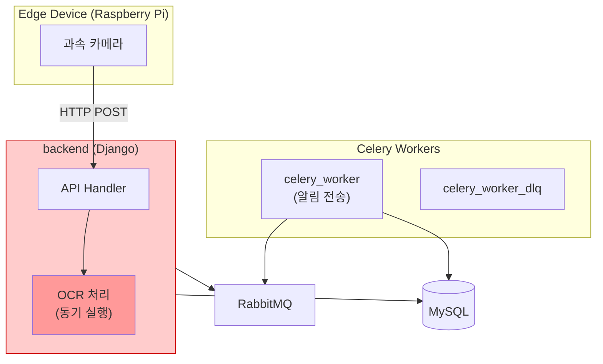

이 구조에서 다음과 같은 **4가지 핵심 문제**가 발생했습니다.

---

### 1.1 문제 1: OCR 동기 처리로 인한 서버 처리량 저하

**문제 상황**

Django 서버에서 OCR을 동기적으로 처리하면서, OCR 작업이 진행되는 동안 HTTP 스레드가 점유됩니다. OCR은 이미지에서 차량 번호판을 인식하는 CPU 집약적 작업으로, 건당 약 3초가 소요됩니다.

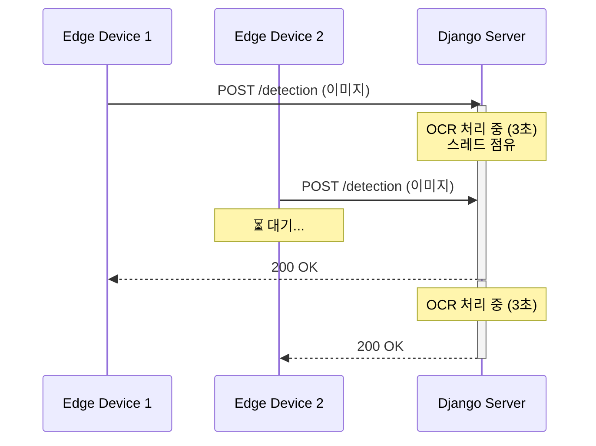

**발생하는 문제**

| 지표 | 영향 |
|------|------|
| 서버 처리량 | 동시 요청 처리 불가, 순차 처리로 병목 발생 |
| 응답 시간 | 요청당 3초 이상 소요 |
| 리소스 효율 | API 서버가 OCR 연산에 리소스 소모 |

---

### 1.2 문제 2: 느린 응답으로 인한 Edge Device 블로킹

**문제 상황**

서버 응답이 3초 이상 걸리면서, Edge Device(Raspberry Pi) 측에서도 연쇄적인 문제가 발생합니다. HTTP 요청을 보낸 후 응답을 기다리는 동안 Edge Device의 스레드가 블로킹됩니다.

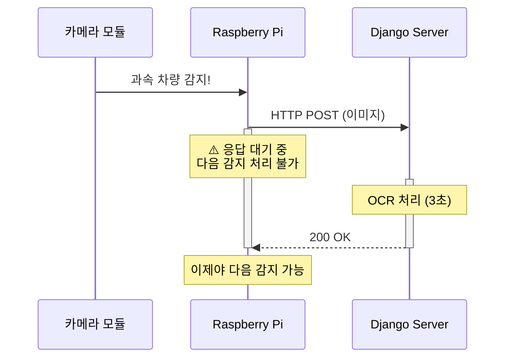

**발생하는 문제**

| 지표 | 영향 |
|------|------|
| Edge 처리량 | 응답 대기 중 새로운 과속 차량 감지 불가 |
| 데이터 유실 | 대기 중 발생한 과속 이벤트 누락 가능 |
| 네트워크 비용 | HTTP 연결 유지 오버헤드 |

---

### 1.3 문제 3: HTTP 기반 IoT 통신의 구조적 한계

**문제 상황**

IoT 환경에서 HTTP는 적합하지 않은 프로토콜입니다:

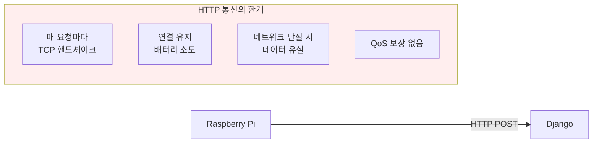

**발생하는 문제**

| 한계 | 설명 |
|------|------|
| 연결 오버헤드 | 매 요청마다 새로운 TCP 연결 수립 필요 |
| 메시지 보장 없음 | 네트워크 불안정 시 데이터 유실, 재전송 로직 직접 구현 필요 |
| 단방향 통신 | 서버→Edge 방향 통신 어려움 (NAT/방화벽 문제) |
| 오프라인 처리 불가 | 네트워크 단절 시 버퍼링 메커니즘 없음 |

---

### 1.4 문제 4: OCR 장애가 전체 서비스에 전파

**문제 상황**

OCR이 Django 프로세스 내에서 실행되므로, OCR 관련 장애가 발생하면 API 서비스 전체에 영향을 미칩니다:

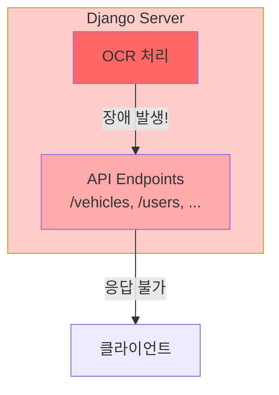

**발생하는 문제**

| 장애 시나리오 | 영향 범위 |
|--------------|----------|
| OCR 라이브러리 메모리 누수 | Django 프로세스 전체 영향 |
| OCR 처리 무한 루프 | API 응답 불가 |
| OCR 의존성 충돌 | 서버 재시작 필요 |

또한, OCR 처리량을 늘리기 위해서는 **Django 서버 전체를 스케일 아웃**해야 하는 비효율이 발생합니다.

---

## 2. 새로운 아키텍처: Event Driven Architecture

위 문제들을 해결하기 위해 **Event Driven Architecture**로 전환했습니다.

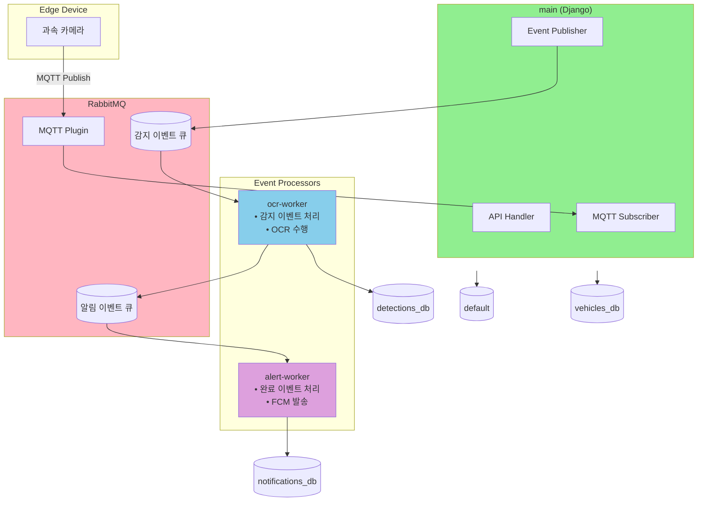

---

## 3. 문제 해결: Before → After

### 3.1 해결 1: 비동기 이벤트 처리로 서버 처리량 극대화

**변경 내용**

OCR 처리를 Django에서 분리하여 전용 Worker가 이벤트를 구독하고 처리합니다.

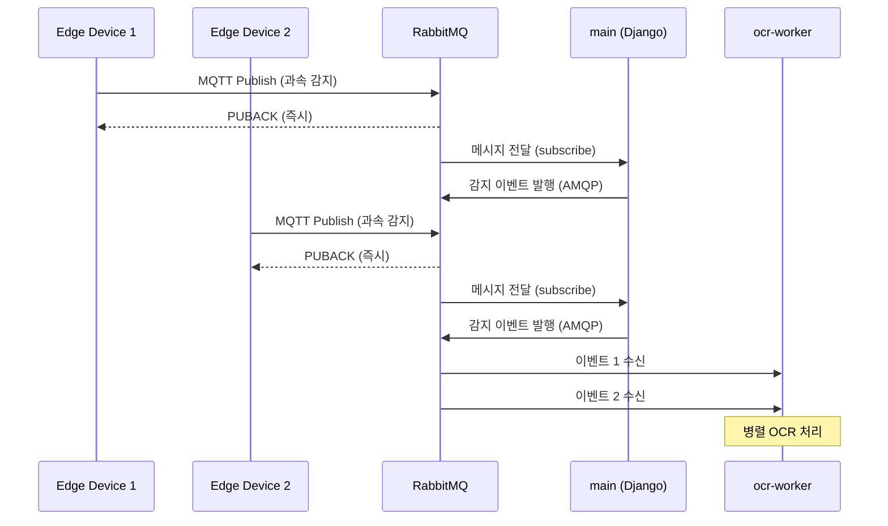

**개선 효과**

| 지표 | Before | After |
|------|--------|-------|
| 응답 시간 | 3초+ | **< 100ms** |
| 동시 처리 | 순차 처리 | **병렬 처리** |
| 서버 역할 | API + OCR | **API만 담당** |

---

### 3.2 해결 2: 즉시 응답으로 Edge Device 해방

**변경 내용**

서버가 이벤트를 큐에 발행하고 즉시 응답하므로, Edge Device는 블로킹 없이 다음 작업을 수행할 수 있습니다.

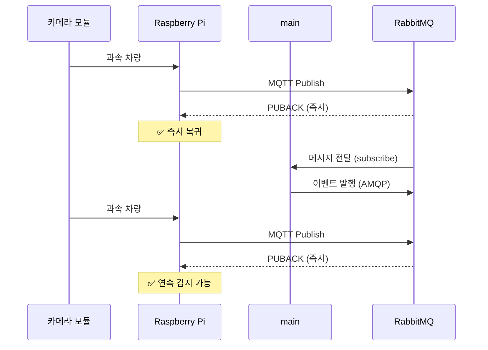

**개선 효과**

| 지표 | Before | After |
|------|--------|-------|
| Edge 블로킹 | 3초+ 대기 | **즉시 복귀** |
| 연속 감지 | 불가 | **가능** |
| 데이터 유실 | 대기 중 누락 | **큐에 보존** |

---

### 3.3 해결 3: MQTT 프로토콜로 IoT 최적화

**변경 내용**

HTTP 대신 IoT에 최적화된 MQTT 프로토콜을 사용합니다. RabbitMQ의 MQTT Plugin을 통해 MQTT와 AMQP를 통합합니다.

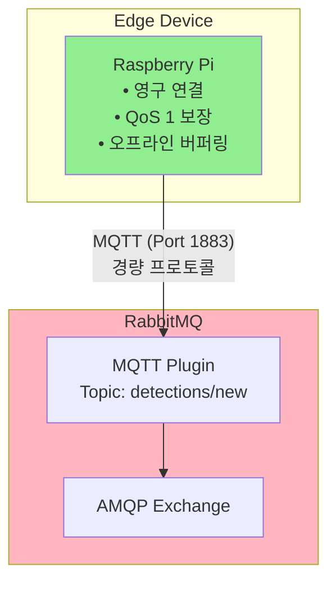

**개선 효과**

| 지표 | Before (HTTP) | After (MQTT) |
|------|---------------|--------------|
| 연결 방식 | 요청마다 연결 | **영구 연결** |
| 메시지 보장 | 없음 | **QoS 1 (At least once)** |
| 오프라인 처리 | 유실 | **브로커 버퍼링** |
| 양방향 통신 | 어려움 | **Subscribe 가능** |
| 프로토콜 오버헤드 | 높음 | **최소화** |

---

### 3.4 해결 4: 완전한 장애 격리와 독립적 확장

**변경 내용**

OCR을 별도 컨테이너로 분리하여 장애가 격리되고, 필요한 컴포넌트만 독립적으로 확장할 수 있습니다.

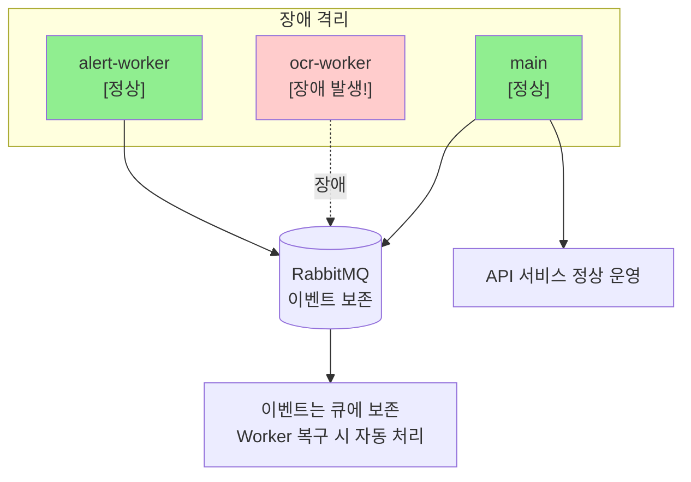

**확장 시나리오**

OCR 처리량이 3배 필요한 경우:

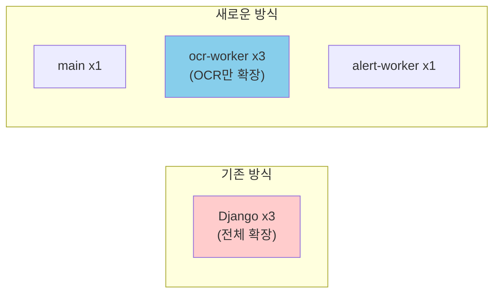

```bash
# OCR Worker만 확장
docker-compose up -d --scale ocr-worker=3
```

**개선 효과**

| 지표 | Before | After |
|------|--------|-------|
| OCR 장애 영향 | API 전체 장애 | **OCR만 지연** |
| 진행 중 작업 | 유실 | **큐에 보존** |
| 확장 단위 | Django 전체 | **Worker별 독립** |
| 리소스 효율 | 낮음 | **필요한 것만 확장** |

---

## 4. 아키텍처 전환 요약

### 4.1 이벤트 흐름

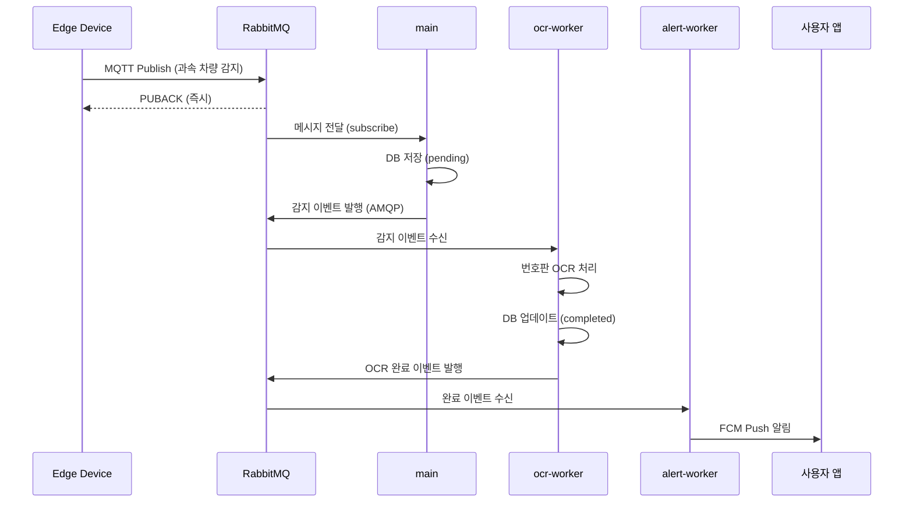

### 4.2 Before vs After 비교

| 문제 영역 | Before | After |
|----------|--------|-------|
| **OCR 처리** | Django 동기 (블로킹) | ocr-worker 비동기 |
| **응답 시간** | 3초+ | < 100ms |
| **IoT 프로토콜** | HTTP (오버헤드) | MQTT (경량, QoS) |
| **메시지 보장** | 없음 | At least once |
| **장애 격리** | 전체 영향 | 컴포넌트 격리 |
| **확장성** | 서버 전체 확장 | Worker별 독립 확장 |
| **데이터베이스** | 단일 DB | 서비스별 4개 DB |

### 4.3 핵심 성과

**기존 아키텍처의 근본적 한계**였던 **OCR 동기 처리**를 제거하고, **Event Driven Architecture**로 전환함으로써:

1. **서버 처리량 극대화**: API 서버는 이벤트 발행만 담당, OCR은 별도 Worker가 병렬 처리
2. **Edge Device 효율화**: 즉시 응답으로 연속 감지 가능, 데이터 유실 방지
3. **IoT 최적화**: MQTT 프로토콜로 경량화, 메시지 전달 보장, 오프라인 대응
4. **운영 안정성**: 장애 격리, 독립적 확장, 이벤트 보존으로 시스템 복원력 확보
