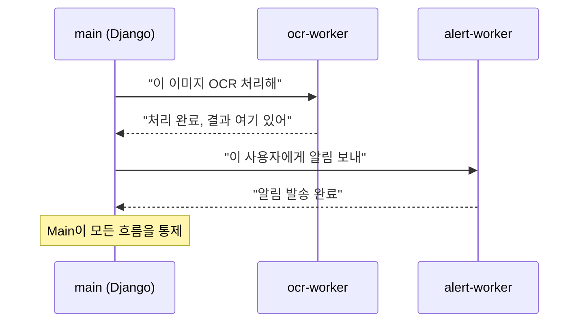
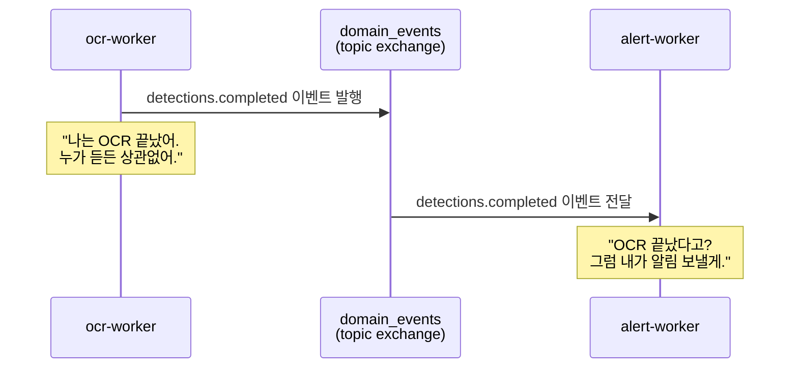
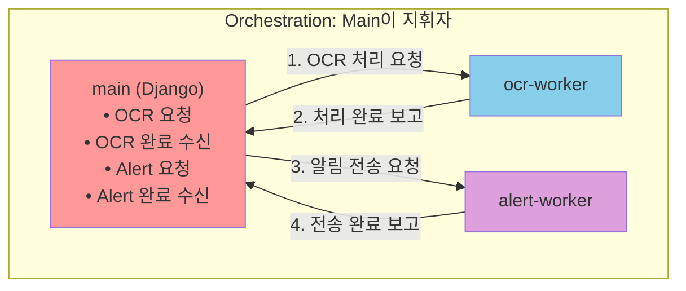
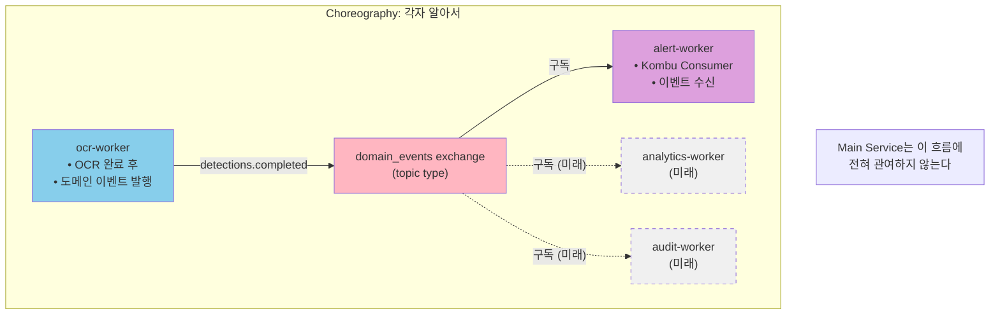
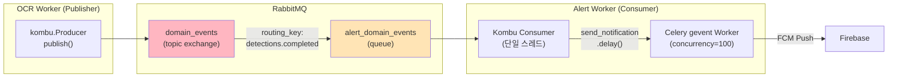
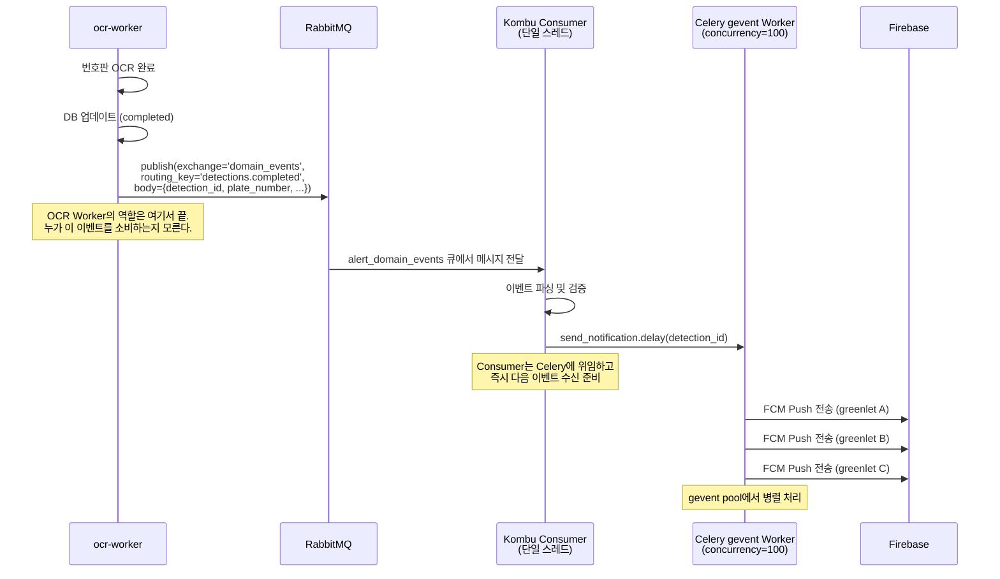
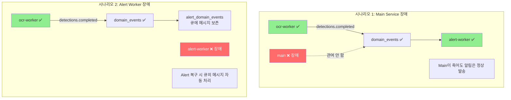
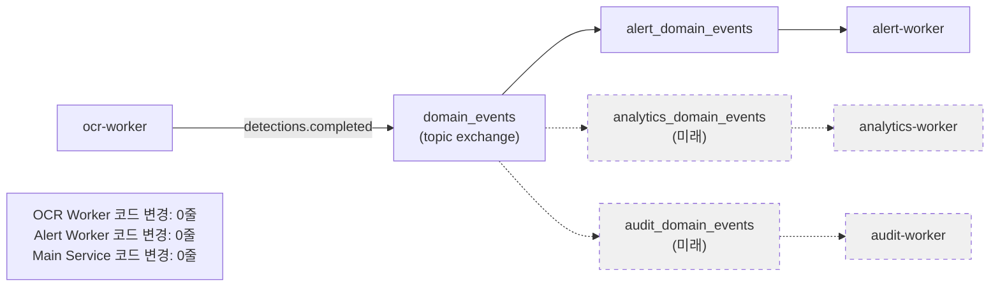

# Alert Worker에 Choreography 패턴을 선택한 이유

> SpeedCam v2 EDA에서 Alert 알림 흐름을 설계할 때, Orchestration이 아닌 Choreography를 선택한 배경과 구현.

---

## Situation — 알림은 누가 시킬 것인가

OCR Worker가 번호판 인식을 마치면 사용자에게 FCM 푸시 알림을 보내야 한다. 이 알림 흐름을 설계할 때 두 가지 선택지가 있었다:

**선택지 A: Main Service(Django)가 중앙에서 지시하는 Orchestration**



**선택지 B: OCR Worker가 "나 끝났어"라고 외치면 Alert Worker가 알아서 듣는 Choreography**



얼핏 보면 Orchestration이 단순해 보인다. Main Service가 전체 흐름을 알고 있으니 디버깅도 쉽고, 순서도 명확하다. 하지만 이 시스템의 맥락을 조금 더 들여다보면 이야기가 달라진다.

---

## Task — 네 가지 기준으로 판단하기

결정의 기준은 명확했다:

1. **커플링**: Main Service가 Alert Worker의 존재를 알아야 하는가?
2. **장애 격리**: OCR이든 Main이든, 한 곳이 죽으면 알림도 죽는가?
3. **확장성**: 새로운 이벤트 소비자(예: 분석 서비스, 로깅)를 추가할 때 기존 코드를 건드려야 하는가?
4. **복잡도**: 구현과 운영의 복잡도는 감당할 수 있는가?

추가로, Alert Worker의 특성을 고려해야 했다. FCM 푸시는 I/O 바운드 작업이라 `--pool=gevent --concurrency=100`으로 동작한다. 단일 스레드 Kombu Consumer가 이벤트를 수신하고, Celery gevent Worker가 병렬로 FCM을 발송하는 구조다. 이 구조에서 Main Service가 중간에 끼어들 이유가 있는지가 핵심 질문이었다.

---

## Action — Choreography를 선택하다

### Orchestration의 문제

Orchestration 패턴에서 Main Service는 오케스트라의 지휘자다. 모든 흐름이 Main을 경유한다:



이 구조의 문제점을 하나씩 살펴보면:

**1. Main Service가 Single Point of Failure가 된다**

Main Service가 죽으면 OCR은 끝났는데 알림이 나가지 않는다. OCR Worker가 "처리 완료"를 보고해도 Main이 없으면 아무도 Alert Worker에게 일을 시키지 못한다. 이벤트가 큐에 쌓여도 Main이 복구될 때까지 알림은 지연된다.

**2. Main Service의 책임이 과도해진다**

Main Service의 본래 역할은 API 서비스와 MQTT 이벤트 수신이다. 여기에 "OCR 완료 후 알림 전송 지시"라는 워크플로우 관리 책임까지 더하면, Main Service가 비즈니스 로직의 God Object가 된다. "알림을 언제, 누구에게 보낼지"는 Alert Worker의 도메인이지, API 서버의 도메인이 아니다.

**3. 확장할 때마다 Main을 건드려야 한다**

나중에 "OCR 완료 시 분석 데이터도 수집하자"라는 요구가 오면? Orchestration에서는 Main Service에 새로운 호출을 추가해야 한다:

```python
# Orchestration: Main Service가 점점 비대해진다
def on_ocr_completed(result):
    alert_worker.send_notification(result)   # 기존
    analytics_worker.collect(result)          # 추가 1
    audit_worker.log(result)                  # 추가 2
    # ... Main이 모든 후속 처리를 알아야 한다
```

### Choreography: 각자 자기 일을 한다

Choreography에서는 OCR Worker가 "나 끝났어"라고 도메인 이벤트를 발행하고, 관심 있는 서비스들이 알아서 구독한다:



새로운 소비자를 추가할 때 기존 서비스의 코드를 한 줄도 건드리지 않는다. 새 서비스가 `domain_events` exchange에 큐를 바인딩하기만 하면 된다. OCR Worker는 누가 듣고 있는지 모르고, 알 필요도 없다.

### 실제 구현

**RabbitMQ 토폴로지:**



- **Exchange**: `domain_events` (topic type) — 도메인 이벤트 전용
- **Routing Key**: `detections.completed` — OCR 완료 이벤트
- **Queue**: `alert_domain_events` — Alert Worker 전용 큐, exchange에 바인딩
- **Consumer**: Kombu 기반, 단일 스레드로 이벤트 수신
- **Worker**: 수신된 이벤트를 `send_notification.delay()`로 Celery 태스크에 위임, gevent pool이 병렬 FCM 발송

> **📸 캡처 1**: RabbitMQ Management UI — Exchanges 탭
> - `http://34.64.183.199:15672` → Exchanges
> - `domain_events` exchange (type: topic) 확인

> **📸 캡처 2**: RabbitMQ Management UI — `domain_events` exchange의 Bindings
> - `alert_domain_events` 큐가 `detections.completed` routing key로 바인딩된 상태

> **📸 캡처 3**: RabbitMQ Management UI — Queues 탭
> - `alert_domain_events` 큐의 메시지 수, consumer 수 확인

**전체 이벤트 흐름 (시퀀스):**



### 왜 Orchestration이 아닌가 — 정리

| 기준 | Orchestration | Choreography |
|------|---------------|--------------|
| **커플링** | Main이 OCR, Alert 모두를 알아야 함 | OCR은 이벤트만 발행, Alert은 이벤트만 구독 |
| **장애 격리** | Main 장애 시 알림 흐름 전체 중단 | Main 장애와 무관하게 알림 정상 동작 |
| **확장성** | 새 소비자 추가 시 Main 코드 수정 필요 | 새 큐를 exchange에 바인딩하면 끝 |
| **책임 분리** | Main이 워크플로우 관리자 역할 병행 | 각 서비스가 자기 도메인에만 집중 |
| **디버깅** | Main에서 전체 흐름을 추적 가능 (**장점**) | 이벤트 흐름이 암묵적, 추적이 어려움 |
| **일관성** | 중앙 제어로 순서 보장 용이 (**장점**) | 이벤트 순서 보장 어려움, 멱등성 필요 |
| **가시성** | 코드만 보면 흐름이 보임 (**장점**) | exchange/queue 바인딩까지 확인해야 함 |

Orchestration의 장점은 분명히 있다. 코드를 읽는 것만으로 "OCR 끝나면 알림 간다"는 흐름이 보인다. Choreography에서는 OCR Worker 코드만 보면 "이벤트를 발행한다"는 것만 알 수 있고, 누가 그 이벤트를 소비하는지는 RabbitMQ Management UI나 인프라 설정을 봐야 한다.

그럼에도 Choreography를 선택한 이유는, **알림은 Main Service의 도메인이 아니기 때문이다.** Main Service는 API 서비스와 MQTT 이벤트 수신이라는 본래 역할에 집중해야 한다. "OCR이 끝나면 알림을 보내라"는 워크플로우 지식을 Main에 넣는 순간, Main은 시스템의 모든 후속 처리를 알아야 하는 God Object가 된다.

Martin Fowler의 표현을 빌리면: Choreography에서 각 서비스는 자기 역할만 수행하고, 시스템 전체의 행동은 서비스들 간의 상호작용에서 **창발(emergent)**한다.

---

## Result — 독립적으로 동작하는 Alert Worker

### 장애 격리 검증

Choreography의 가장 큰 이점은 장애 격리에서 드러난다:



- **Main Service 장애**: OCR Worker → domain_events exchange → Alert Worker 경로에 Main이 없으므로, 알림 흐름에 영향 없음
- **Alert Worker 장애**: 이벤트는 `alert_domain_events` 큐에 보존되고, Worker 복구 시 자동으로 소비
- **OCR Worker 장애**: Alert Worker는 이벤트가 안 오니 idle 상태일 뿐, 장애가 전파되지 않음

### 부하 테스트 결과

burst 600건의 감지 메시지를 발행한 부하 테스트에서:
- OCR Worker가 처리를 완료하면 `detections.completed` 이벤트 자동 발행
- Alert Worker의 Kombu Consumer가 이벤트를 수신하고 `send_notification.delay()` 호출
- Celery gevent Worker(concurrency=100)가 병렬로 FCM 발송
- **356건의 알림이 자동 발송됨** — Main Service는 이 과정에 전혀 관여하지 않았음

> **📸 캡처 4**: Grafana 대시보드 — Alert Worker 메트릭
> - `http://34.47.70.132:3000` → Alert Worker 대시보드
> - 부하 테스트 시점의 이벤트 수신 및 알림 발송 그래프

### 확장성: 미래의 소비자 추가



새로운 서비스가 `detections.completed` 이벤트를 소비하고 싶다면:
1. 새 큐를 생성하고 `domain_events` exchange에 바인딩
2. 새 서비스에서 해당 큐를 구독
3. **기존 서비스 코드 변경: 0줄**

이것이 Choreography의 본질적 가치다. 시스템은 **새로운 참여자의 등장에 열려 있고, 기존 참여자의 변경에 닫혀 있다.** Open-Closed Principle이 서비스 간 통신 수준에서 실현된다.

### 솔직한 Trade-off

Choreography가 만능은 아니다. 운영하면서 느낀 단점도 있다:

| 단점 | 영향 | 대응 |
|------|------|------|
| **흐름 추적 어려움** | "이 이벤트를 누가 소비하지?" → 코드만으로는 안 보임 | RabbitMQ Management UI에서 exchange binding 확인, Jaeger 분산 트레이싱 |
| **디버깅 복잡도** | 이벤트 발행은 됐는데 알림이 안 간다면? 원인이 여러 곳에 분산 | Loki 로그 + Jaeger 트레이스 + RabbitMQ 큐 모니터링 조합 |
| **암묵적 의존성** | exchange/queue 바인딩이 코드에 드러나지 않음 | 인프라 문서화, ARCHITECTURE_COMPARISON.md에 전체 흐름 기록 |
| **이벤트 순서** | 여러 소비자가 이벤트를 받는 순서를 보장할 수 없음 | 각 소비자가 멱등하게 동작하도록 설계 |

이 trade-off를 감수할 수 있었던 이유는, 모니터링 스택(Prometheus + Grafana + Loki + Jaeger)이 이미 구축되어 있었기 때문이다. 흐름의 가시성이 코드에서 인프라 모니터링으로 이동하는 것이지, 사라지는 것은 아니다.

---

## References

### 공식 문서

- [Martin Fowler — Microservices: Choreography vs Orchestration](https://martinfowler.com/bliki/ServiceOrientedAmbiguity.html)
- [RabbitMQ — Topic Exchange](https://www.rabbitmq.com/tutorials/tutorial-five-python)
- [Kombu — Consumer Guide](https://docs.celeryq.dev/projects/kombu/en/stable/userguide/consumers.html)

### 기술 블로그

- [Chris Richardson — Pattern: Choreography](https://microservices.io/patterns/data/choreography.html)
- [AWS — Choreography vs. Orchestration in the Land of Serverless](https://aws.amazon.com/blogs/compute/operating-lambda-understanding-event-driven-architecture-part-3/)

### 관련 프로젝트 문서

- [ARCHITECTURE_COMPARISON.md](./ARCHITECTURE_COMPARISON.md) — 전체 아키텍처 진화 과정
- [GEVENT_DB_THREAD_SAFETY.md](./GEVENT_DB_THREAD_SAFETY.md) — Alert Worker의 gevent pool + Django ORM 이슈
