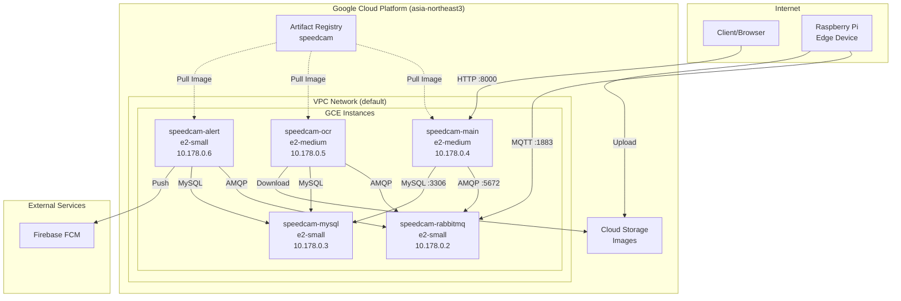
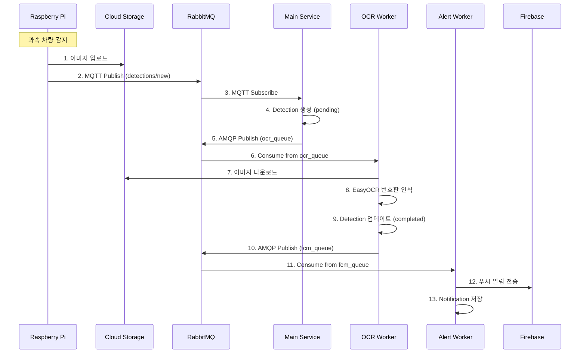
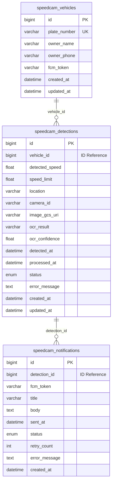

# GCP 배포 가이드

## 목차
1. [사전 요구사항](#1-사전-요구사항)
2. [시스템 아키텍처](#2-시스템-아키텍처)
3. [배포 단계](#3-배포-단계)
4. [배포 검증](#4-배포-검증)
5. [운영 가이드](#5-운영-가이드)
6. [트러블슈팅](#6-트러블슈팅)

---

## 1. 사전 요구사항

### 1.1 필수 도구 설치

| 도구 | 버전 | 설치 방법 |
|------|------|----------|
| Google Cloud SDK | 최신 | https://cloud.google.com/sdk/docs/install |
| Docker | 20.10+ | https://docs.docker.com/get-docker/ |
| Terraform | 1.5+ | https://developer.hashicorp.com/terraform/downloads |
| Make | 3.81+ | 기본 설치됨 (macOS/Linux) |

### 1.2 GCP 프로젝트 설정

```bash
# gcloud 초기화 및 로그인
gcloud init

# 프로젝트 확인
gcloud config get-value project

# 필수 API 활성화
gcloud services enable compute.googleapis.com
gcloud services enable artifactregistry.googleapis.com
```

### 1.3 환경 변수 설정

```bash
# 프로젝트 설정
export GCP_PROJECT_ID=your-project-id
export GCP_REGION=asia-northeast3
export GCP_ZONE=asia-northeast3-a

# Docker Registry
export REGISTRY=${GCP_REGION}-docker.pkg.dev/${GCP_PROJECT_ID}/speedcam
```

---

## 2. 시스템 아키텍처

### 2.1 전체 아키텍처



### 2.2 메시지 흐름



### 2.3 데이터베이스 구조



### 2.4 인스턴스 사양

| 인스턴스 | 역할 | Machine Type | vCPU | Memory | 포트 |
|----------|------|--------------|------|--------|------|
| speedcam-rabbitmq | Message Broker | e2-small | 0.5-2 | 2GB | 5672, 1883, 15672 |
| speedcam-mysql | Database | e2-small | 0.5-2 | 2GB | 3306 |
| speedcam-main | Django API + MQTT | e2-medium | 1-2 | 4GB | 8000 |
| speedcam-ocr | OCR Worker (prefork) | e2-medium | 1-2 | 4GB | - |
| speedcam-alert | Alert Worker (gevent) | e2-small | 0.5-2 | 2GB | - |

---

## 3. 배포 단계

### 3.1 Step 1: Artifact Registry 설정

```bash
# 저장소 생성
gcloud artifacts repositories create speedcam \
  --repository-format=docker \
  --location=${GCP_REGION} \
  --description="Speedcam MSA Docker images"

# Docker 인증 설정
gcloud auth configure-docker ${GCP_REGION}-docker.pkg.dev
```

### 3.2 Step 2: Docker 이미지 빌드

```bash
# linux/amd64 플랫폼으로 빌드 (GCE용)
docker build --platform linux/amd64 \
  -t ${REGISTRY}/main:latest \
  -f docker/Dockerfile.main .

docker build --platform linux/amd64 \
  -t ${REGISTRY}/ocr:latest \
  -f docker/Dockerfile.ocr .

docker build --platform linux/amd64 \
  -t ${REGISTRY}/alert:latest \
  -f docker/Dockerfile.alert .
```

### 3.3 Step 3: Docker 이미지 푸시

```bash
docker push ${REGISTRY}/main:latest
docker push ${REGISTRY}/ocr:latest
docker push ${REGISTRY}/alert:latest
```

### 3.4 Step 4: 방화벽 규칙 생성

```bash
# 내부 통신용
gcloud compute firewall-rules create speedcam-internal \
  --network=default \
  --allow=tcp:3306,tcp:5672,tcp:1883,tcp:15672,tcp:8000 \
  --source-ranges=10.0.0.0/8 \
  --target-tags=speedcam

# 외부 접근용
gcloud compute firewall-rules create speedcam-external \
  --network=default \
  --allow=tcp:8000,tcp:15672 \
  --source-ranges=0.0.0.0/0 \
  --target-tags=speedcam-web
```

### 3.5 Step 5: 인프라 인스턴스 생성

#### RabbitMQ

```bash
gcloud compute instances create-with-container speedcam-rabbitmq \
  --zone=${GCP_ZONE} \
  --machine-type=e2-small \
  --tags=speedcam,speedcam-web \
  --container-image=rabbitmq:3.13-management \
  --container-env="RABBITMQ_DEFAULT_USER=sa,RABBITMQ_DEFAULT_PASS=1234"
```

#### MySQL

```bash
gcloud compute instances create-with-container speedcam-mysql \
  --zone=${GCP_ZONE} \
  --machine-type=e2-small \
  --tags=speedcam \
  --container-image=mysql:8.0 \
  --container-env="MYSQL_ROOT_PASSWORD=root,MYSQL_USER=sa,MYSQL_PASSWORD=1234,MYSQL_DATABASE=speedcam"
```

### 3.6 Step 6: 인프라 초기화

```bash
# RabbitMQ MQTT 플러그인 활성화
gcloud compute ssh speedcam-rabbitmq --zone=${GCP_ZONE} \
  --command="docker exec \$(docker ps -q) rabbitmq-plugins enable rabbitmq_mqtt"

# MySQL 추가 데이터베이스 생성
gcloud compute ssh speedcam-mysql --zone=${GCP_ZONE} \
  --command="docker exec \$(docker ps -q) mysql -u root -proot -e \"
    CREATE DATABASE IF NOT EXISTS speedcam_vehicles;
    CREATE DATABASE IF NOT EXISTS speedcam_detections;
    CREATE DATABASE IF NOT EXISTS speedcam_notifications;
    GRANT ALL PRIVILEGES ON speedcam_vehicles.* TO 'sa'@'%';
    GRANT ALL PRIVILEGES ON speedcam_detections.* TO 'sa'@'%';
    GRANT ALL PRIVILEGES ON speedcam_notifications.* TO 'sa'@'%';
    FLUSH PRIVILEGES;\""
```

### 3.7 Step 7: Internal IP 확인

```bash
# 인스턴스 IP 확인
gcloud compute instances list --filter="name~speedcam" \
  --format="table(name,networkInterfaces[0].networkIP)"

# 예시 출력:
# speedcam-rabbitmq  10.178.0.2
# speedcam-mysql     10.178.0.3
```

### 3.8 Step 8: 서비스 인스턴스 생성

```bash
# 환경 변수 (Internal IP로 대체)
RABBITMQ_IP=10.178.0.2
MYSQL_IP=10.178.0.3

# Main Service
gcloud compute instances create-with-container speedcam-main \
  --zone=${GCP_ZONE} \
  --machine-type=e2-medium \
  --tags=speedcam,speedcam-web \
  --scopes=cloud-platform \
  --container-image=${REGISTRY}/main:latest \
  --container-env="DJANGO_SETTINGS_MODULE=config.settings.dev,\
DB_HOST=${MYSQL_IP},DB_PORT=3306,\
DB_NAME=speedcam,DB_NAME_VEHICLES=speedcam_vehicles,\
DB_NAME_DETECTIONS=speedcam_detections,DB_NAME_NOTIFICATIONS=speedcam_notifications,\
DB_USER=sa,DB_PASSWORD=1234,\
CELERY_BROKER_URL=amqp://sa:1234@${RABBITMQ_IP}:5672//,\
RABBITMQ_HOST=${RABBITMQ_IP},MQTT_PORT=1883,MQTT_USER=sa,MQTT_PASS=1234,\
OCR_MOCK=true,FCM_MOCK=true"

# OCR Worker
gcloud compute instances create-with-container speedcam-ocr \
  --zone=${GCP_ZONE} \
  --machine-type=e2-medium \
  --tags=speedcam \
  --scopes=cloud-platform \
  --container-image=${REGISTRY}/ocr:latest \
  --container-env="DJANGO_SETTINGS_MODULE=config.settings.dev,\
DB_HOST=${MYSQL_IP},DB_PORT=3306,\
DB_NAME=speedcam,DB_NAME_VEHICLES=speedcam_vehicles,\
DB_NAME_DETECTIONS=speedcam_detections,DB_NAME_NOTIFICATIONS=speedcam_notifications,\
DB_USER=sa,DB_PASSWORD=1234,\
CELERY_BROKER_URL=amqp://sa:1234@${RABBITMQ_IP}:5672//,\
OCR_CONCURRENCY=2,OCR_MOCK=true"

# Alert Worker
gcloud compute instances create-with-container speedcam-alert \
  --zone=${GCP_ZONE} \
  --machine-type=e2-small \
  --tags=speedcam \
  --scopes=cloud-platform \
  --container-image=${REGISTRY}/alert:latest \
  --container-env="DJANGO_SETTINGS_MODULE=config.settings.dev,\
DB_HOST=${MYSQL_IP},DB_PORT=3306,\
DB_NAME=speedcam,DB_NAME_VEHICLES=speedcam_vehicles,\
DB_NAME_DETECTIONS=speedcam_detections,DB_NAME_NOTIFICATIONS=speedcam_notifications,\
DB_USER=sa,DB_PASSWORD=1234,\
CELERY_BROKER_URL=amqp://sa:1234@${RABBITMQ_IP}:5672//,\
ALERT_CONCURRENCY=50,FCM_MOCK=true"
```

### 3.9 Step 9: Django 마이그레이션

```bash
gcloud compute ssh speedcam-main --zone=${GCP_ZONE} --command="\
docker exec \$(docker ps -q) python manage.py makemigrations vehicles detections notifications && \
docker exec \$(docker ps -q) python manage.py migrate --database=default --noinput && \
docker exec \$(docker ps -q) python manage.py migrate vehicles --database=vehicles_db --noinput && \
docker exec \$(docker ps -q) python manage.py migrate detections --database=detections_db --noinput && \
docker exec \$(docker ps -q) python manage.py migrate notifications --database=notifications_db --noinput"
```

---

## 4. 배포 검증

### 4.1 인스턴스 상태 확인

```bash
gcloud compute instances list --filter="name~speedcam"
```

### 4.2 서비스 헬스체크

```bash
# Main API External IP 확인
MAIN_IP=$(gcloud compute instances describe speedcam-main \
  --zone=${GCP_ZONE} \
  --format='get(networkInterfaces[0].accessConfigs[0].natIP)')

# Health Check
curl http://${MAIN_IP}:8000/health/
# Expected: {"status": "healthy"}

# Swagger UI
echo "Swagger: http://${MAIN_IP}:8000/swagger/"
```

### 4.3 RabbitMQ 확인

```bash
RABBITMQ_IP=$(gcloud compute instances describe speedcam-rabbitmq \
  --zone=${GCP_ZONE} \
  --format='get(networkInterfaces[0].accessConfigs[0].natIP)')

echo "RabbitMQ Management: http://${RABBITMQ_IP}:15672/"
# Credentials: sa / 1234
```

### 4.4 Worker 로그 확인

```bash
# OCR Worker
gcloud compute ssh speedcam-ocr --zone=${GCP_ZONE} \
  --command="docker logs \$(docker ps -q) 2>&1 | tail -20"

# Alert Worker
gcloud compute ssh speedcam-alert --zone=${GCP_ZONE} \
  --command="docker logs \$(docker ps -q) 2>&1 | tail -20"
```

---

## 5. 운영 가이드

### 5.1 인스턴스 재시작

```bash
# 개별 재시작
gcloud compute instances reset speedcam-main --zone=${GCP_ZONE}

# 전체 서비스 재시작
gcloud compute instances reset speedcam-main speedcam-ocr speedcam-alert --zone=${GCP_ZONE}
```

### 5.2 이미지 업데이트 배포

```bash
# 1. 새 이미지 빌드 & 푸시
docker build --platform linux/amd64 -t ${REGISTRY}/main:latest -f docker/Dockerfile.main .
docker push ${REGISTRY}/main:latest

# 2. 인스턴스 재시작 (새 이미지 pull)
gcloud compute instances reset speedcam-main --zone=${GCP_ZONE}
```

### 5.3 스케일링

```bash
# OCR Worker 추가 인스턴스
gcloud compute instances create-with-container speedcam-ocr-2 \
  --zone=${GCP_ZONE} \
  --machine-type=e2-medium \
  --tags=speedcam \
  --scopes=cloud-platform \
  --container-image=${REGISTRY}/ocr:latest \
  --container-env="..." # 동일한 환경변수
```

### 5.4 로그 모니터링

```bash
# 실시간 로그
gcloud compute ssh speedcam-main --zone=${GCP_ZONE} \
  --command="docker logs -f \$(docker ps -q)"
```

---

## 6. 트러블슈팅

### 6.1 컨테이너 시작 실패

```bash
# 컨테이너 상태 확인
gcloud compute ssh speedcam-main --zone=${GCP_ZONE} \
  --command="docker ps -a"

# 종료된 컨테이너 로그 확인
gcloud compute ssh speedcam-main --zone=${GCP_ZONE} \
  --command="docker logs \$(docker ps -aq | head -1)"
```

### 6.2 DB 연결 실패

```bash
# MySQL 연결 테스트
gcloud compute ssh speedcam-main --zone=${GCP_ZONE} \
  --command="docker exec \$(docker ps -q) python -c \"
import pymysql
conn = pymysql.connect(host='10.178.0.3', user='sa', password='1234', database='speedcam')
print('Connected!')
conn.close()\""
```

### 6.3 MQTT 연결 실패

```bash
# RabbitMQ MQTT 플러그인 상태 확인
gcloud compute ssh speedcam-rabbitmq --zone=${GCP_ZONE} \
  --command="docker exec \$(docker ps -q) rabbitmq-plugins list | grep mqtt"
```

### 6.4 이미지 Pull 실패

```bash
# 서비스 계정 권한 확인
gcloud compute instances describe speedcam-main --zone=${GCP_ZONE} \
  --format='get(serviceAccounts[0].scopes)'

# cloud-platform 스코프 필요
```

---

## 7. 리소스 정리

```bash
# 모든 인스턴스 삭제
gcloud compute instances delete \
  speedcam-rabbitmq speedcam-mysql \
  speedcam-main speedcam-ocr speedcam-alert \
  --zone=${GCP_ZONE} --quiet

# 방화벽 규칙 삭제
gcloud compute firewall-rules delete speedcam-internal speedcam-external --quiet

# Artifact Registry 삭제
gcloud artifacts repositories delete speedcam --location=${GCP_REGION} --quiet
```

---

## 변경 이력

| 날짜 | 버전 | 변경 내용 |
|------|------|----------|
| 2026-01-23 | 1.0 | 초기 문서 작성 |
