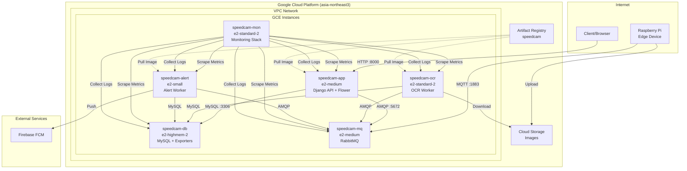
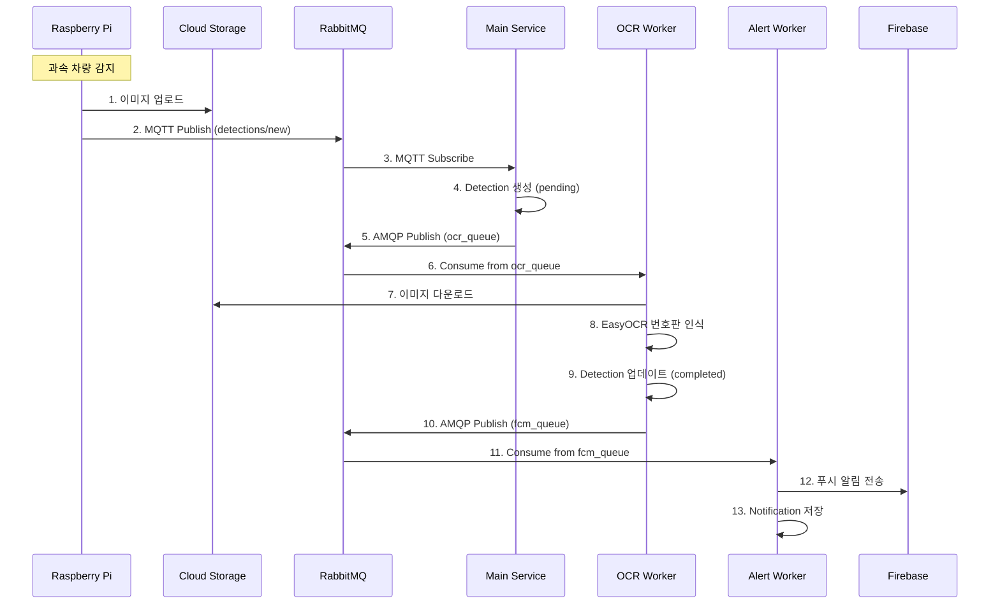
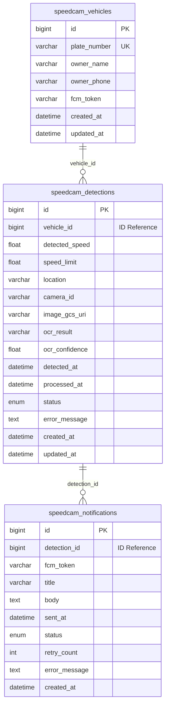

# GCP 멀티 인스턴스 배포 가이드

## 목차

1. [사전 요구사항](#1-사전-요구사항)
2. [시스템 아키텍처](#2-시스템-아키텍처)
3. [GCP 인프라 설정](#3-gcp-인프라-설정)
4. [배포 디렉토리 구조](#4-배포-디렉토리-구조)
5. [Docker Compose 파일](#5-docker-compose-파일)
6. [설정 파일](#6-설정-파일)
7. [Docker 이미지 빌드 및 배포](#7-docker-이미지-빌드-및-배포)
8. [배포 순서](#8-배포-순서)
9. [배포 검증](#9-배포-검증)
10. [운영 가이드](#10-운영-가이드)
11. [트러블슈팅](#11-트러블슈팅)
12. [리소스 정리](#12-리소스-정리)

---

## 1. 사전 요구사항

### 1.1 필수 도구 설치

| 도구 | 버전 | 설치 방법 |
|------|------|----------|
| Google Cloud SDK | 최신 | https://cloud.google.com/sdk/docs/install |
| Docker | 20.10+ | https://docs.docker.com/get-docker/ |
| Docker Compose | 2.0+ | Docker Desktop 포함 또는 별도 설치 |
| Make | 3.81+ | 기본 설치됨 (macOS/Linux) |

### 1.2 GCP 프로젝트 설정

```bash
# gcloud 초기화 및 로그인
gcloud init

# 프로젝트 확인
gcloud config get-value project

# 필수 API 활성화
gcloud services enable compute.googleapis.com
gcloud services enable artifactregistry.googleapis.com
```

### 1.3 환경 변수 설정

```bash
# 프로젝트 설정
export GCP_PROJECT_ID=<your-project-id>
export GCP_REGION=asia-northeast3
export GCP_ZONE=asia-northeast3-a

# Docker Registry (Artifact Registry 사용)
export ARTIFACT_REGISTRY=${GCP_REGION}-docker.pkg.dev/${GCP_PROJECT_ID}/speedcam
```

---

## 2. 시스템 아키텍처

### 2.1 전체 아키텍처



### 2.2 메시지 흐름



### 2.3 데이터베이스 구조



### 2.4 인스턴스 사양

| 인스턴스 이름 | 역할 | 머신 타입 | vCPU | Memory | 열어야 할 포트 (내부) |
|--------------|------|----------|------|--------|---------------------|
| `speedcam-db` | MySQL + Exporters | e2-highmem-2 | 2 | 16GB | 3306, 9104, 8080 |
| `speedcam-mq` | RabbitMQ | e2-medium | 2 | 4GB | 5672, 1883, 15672, 15692, 8080 |
| `speedcam-app` | Django API + Flower | e2-medium | 2 | 4GB | 8000, 5555, 8080 |
| `speedcam-ocr` | OCR Celery Worker | e2-standard-2 | 2 | 8GB | 8080 |
| `speedcam-alert` | Alert Celery Worker | e2-small | 2 | 2GB | 8080 |
| `speedcam-mon` | 모니터링 전체 스택 | e2-standard-2 | 2 | 8GB | 3000, 9090, 16686, 3100, 4317, 4318, 8889, 9808, 8080 |

---

## 3. GCP 인프라 설정

### 3.1 VPC 네트워크 생성

```bash
# VPC 네트워크 생성 (커스텀 모드)
gcloud compute networks create speedcam-vpc \
    --subnet-mode=custom \
    --bgp-routing-mode=regional

# 서브넷 생성 (asia-northeast3)
gcloud compute networks subnets create speedcam-subnet \
    --network=speedcam-vpc \
    --region=${GCP_REGION} \
    --range=10.178.0.0/20
```

### 3.2 방화벽 규칙 설정

#### 3.2.1 내부 통신 허용

```bash
# 내부 통신 허용 (VPC 내부에서만)
gcloud compute firewall-rules create speedcam-internal \
    --network=speedcam-vpc \
    --allow=tcp:3306,tcp:5672,tcp:1883,tcp:15672,tcp:15692,tcp:8000,tcp:5555,tcp:4317,tcp:4318,tcp:8889,tcp:9090,tcp:3000,tcp:16686,tcp:3100,tcp:9104,tcp:9808,tcp:8080,tcp:9080 \
    --source-ranges=10.178.0.0/20 \
    --target-tags=speedcam \
    --description="SpeedCam internal communication"
```

#### 3.2.2 외부 접근 허용 (필요한 서비스만)

```bash
# Django API 외부 접근 (프론트엔드)
gcloud compute firewall-rules create speedcam-api-external \
    --network=speedcam-vpc \
    --allow=tcp:8000 \
    --source-ranges=0.0.0.0/0 \
    --target-tags=speedcam-app \
    --description="Django API external access"

# MQTT 외부 접근 (Edge Device)
gcloud compute firewall-rules create speedcam-mqtt-external \
    --network=speedcam-vpc \
    --allow=tcp:1883 \
    --source-ranges=0.0.0.0/0 \
    --target-tags=speedcam-mq \
    --description="MQTT external access for edge devices"

# Grafana UI 외부 접근 (운영자만)
gcloud compute firewall-rules create speedcam-grafana-external \
    --network=speedcam-vpc \
    --allow=tcp:3000 \
    --source-ranges=<ADMIN_IP>/32 \
    --target-tags=speedcam-mon \
    --description="Grafana external access (admin only)"
```

### 3.3 Artifact Registry 설정

```bash
# 저장소 생성
gcloud artifacts repositories create speedcam \
    --repository-format=docker \
    --location=${GCP_REGION} \
    --description="Speedcam MSA Docker images"

# Docker 인증 설정
gcloud auth configure-docker ${GCP_REGION}-docker.pkg.dev
```

### 3.4 GCE 인스턴스 생성

```bash
# 1. speedcam-db 인스턴스
gcloud compute instances create speedcam-db \
    --zone=${GCP_ZONE} \
    --machine-type=e2-highmem-2 \
    --network-interface=subnet=speedcam-subnet,no-address \
    --tags=speedcam \
    --metadata=startup-script='#!/bin/bash
apt-get update
apt-get install -y docker.io docker-compose
systemctl start docker
systemctl enable docker'

# 2. speedcam-mq 인스턴스
gcloud compute instances create speedcam-mq \
    --zone=${GCP_ZONE} \
    --machine-type=e2-medium \
    --network-interface=subnet=speedcam-subnet,no-address \
    --tags=speedcam,speedcam-mq \
    --metadata=startup-script='#!/bin/bash
apt-get update
apt-get install -y docker.io docker-compose
systemctl start docker
systemctl enable docker'

# 3. speedcam-app 인스턴스
gcloud compute instances create speedcam-app \
    --zone=${GCP_ZONE} \
    --machine-type=e2-medium \
    --network-interface=subnet=speedcam-subnet,no-address \
    --tags=speedcam,speedcam-app \
    --scopes=cloud-platform \
    --metadata=startup-script='#!/bin/bash
apt-get update
apt-get install -y docker.io docker-compose
systemctl start docker
systemctl enable docker'

# 4. speedcam-ocr 인스턴스
gcloud compute instances create speedcam-ocr \
    --zone=${GCP_ZONE} \
    --machine-type=e2-standard-2 \
    --network-interface=subnet=speedcam-subnet,no-address \
    --tags=speedcam \
    --scopes=cloud-platform \
    --metadata=startup-script='#!/bin/bash
apt-get update
apt-get install -y docker.io docker-compose
systemctl start docker
systemctl enable docker'

# 5. speedcam-alert 인스턴스
gcloud compute instances create speedcam-alert \
    --zone=${GCP_ZONE} \
    --machine-type=e2-small \
    --network-interface=subnet=speedcam-subnet,no-address \
    --tags=speedcam \
    --scopes=cloud-platform \
    --metadata=startup-script='#!/bin/bash
apt-get update
apt-get install -y docker.io docker-compose
systemctl start docker
systemctl enable docker'

# 6. speedcam-mon 인스턴스
gcloud compute instances create speedcam-mon \
    --zone=${GCP_ZONE} \
    --machine-type=e2-standard-2 \
    --network-interface=subnet=speedcam-subnet,no-address \
    --tags=speedcam,speedcam-mon \
    --metadata=startup-script='#!/bin/bash
apt-get update
apt-get install -y docker.io docker-compose
systemctl start docker
systemctl enable docker'
```

---

## 4. 배포 디렉토리 구조

각 인스턴스에 배포할 파일 구조:

```
deploy/
├── env/
│   ├── backend.env              # Django/Celery 공통 환경변수
│   ├── mysql.env                # MySQL 전용 (DB 인스턴스만)
│   └── rabbitmq.env             # RabbitMQ 전용 (MQ 인스턴스만)
├── compose/
│   ├── docker-compose.db.yml
│   ├── docker-compose.mq.yml
│   ├── docker-compose.app.yml
│   ├── docker-compose.ocr.yml
│   ├── docker-compose.alert.yml
│   └── docker-compose.mon.yml
├── config/
│   ├── mysql/
│   │   └── init.sql
│   ├── monitoring/
│   │   ├── otel-collector/
│   │   │   └── otel-collector-config.yml
│   │   ├── prometheus/
│   │   │   └── prometheus.yml
│   │   ├── loki/
│   │   │   └── loki-config.yml
│   │   ├── promtail/
│   │   │   ├── promtail-config.yml       # 각 인스턴스용
│   │   │   └── promtail-config.mon.yml   # 모니터링 인스턴스용
│   │   ├── grafana/
│   │   │   └── provisioning/
│   │   │       ├── datasources/
│   │   │       │   └── datasources.yml
│   │   │       └── dashboards/
│   │   │           └── dashboards.yml
│   │   └── mysqld-exporter/
│   │       └── .my.cnf
│   └── credentials/
│       └── (GCP, Firebase 인증 파일)
└── images/
    └── (빌드된 이미지는 Artifact Registry 사용)
```

---

## 5. Docker Compose 파일

### 5.1 로컬 → 멀티 인스턴스 주요 변경점

| 항목 | 로컬 (현재) | 멀티 인스턴스 |
|------|------------|--------------|
| 네트워크 | `networks: speedcam-network` (bridge) | `network_mode: host` |
| 서비스 디스커버리 | 컨테이너명 (`mysql`, `rabbitmq`) | GCP 내부 IP |
| 포트 매핑 | `ports: "3306:3306"` | 불필요 (host 모드에서 직접 바인딩) |
| depends_on | 서비스 간 의존성 | 제거 (다른 인스턴스에 있으므로) |
| 이미지 | `build: context` | Artifact Registry 이미지 |
| cAdvisor | 모니터링에 1개 | 모든 인스턴스에 1개씩 |
| Promtail | 모니터링에 1개 | 모든 인스턴스에 1개씩 |

### 5.2 docker-compose.db.yml

speedcam-db 인스턴스에 배포

```yaml
services:
  mysql:
    image: mysql:8.0
    container_name: speedcam-mysql
    restart: always
    network_mode: host
    env_file:
      - ../env/mysql.env
    volumes:
      - mysql_data:/var/lib/mysql
      - ../config/mysql/init.sql:/docker-entrypoint-initdb.d/init.sql:ro
    healthcheck:
      test: ["CMD", "mysqladmin", "ping", "-h", "localhost"]
      interval: 10s
      timeout: 5s
      retries: 5

  mysqld-exporter:
    image: prom/mysqld-exporter:v0.15.1
    container_name: speedcam-mysqld-exporter
    restart: always
    network_mode: host
    volumes:
      - ../config/monitoring/mysqld-exporter/.my.cnf:/cfg/.my.cnf:ro
    command:
      - "--config.my-cnf=/cfg/.my.cnf"
    depends_on:
      mysql:
        condition: service_healthy

  promtail:
    image: grafana/promtail:2.9.6
    container_name: speedcam-promtail
    restart: always
    network_mode: host
    volumes:
      - ../config/monitoring/promtail/promtail-config.yml:/etc/promtail/config.yml:ro
      - /var/run/docker.sock:/var/run/docker.sock:ro
      - /var/lib/docker/containers:/var/lib/docker/containers:ro
    command: -config.file=/etc/promtail/config.yml

  cadvisor:
    image: gcr.io/cadvisor/cadvisor:v0.49.1
    container_name: speedcam-cadvisor
    restart: always
    network_mode: host
    volumes:
      - /:/rootfs:ro
      - /var/run:/var/run:ro
      - /sys:/sys:ro
      - /var/lib/docker/:/var/lib/docker:ro

volumes:
  mysql_data:
```

### 5.3 docker-compose.mq.yml

speedcam-mq 인스턴스에 배포

```yaml
services:
  rabbitmq:
    image: rabbitmq:3.13-management
    container_name: speedcam-rabbitmq
    restart: always
    network_mode: host
    env_file:
      - ../env/rabbitmq.env
    volumes:
      - rabbitmq_data:/var/lib/rabbitmq
    command: >
      bash -c "rabbitmq-plugins enable --offline rabbitmq_mqtt rabbitmq_prometheus &&
               rabbitmq-server"
    healthcheck:
      test: ["CMD", "rabbitmq-diagnostics", "check_running"]
      interval: 10s
      timeout: 5s
      retries: 5

  promtail:
    image: grafana/promtail:2.9.6
    container_name: speedcam-promtail
    restart: always
    network_mode: host
    volumes:
      - ../config/monitoring/promtail/promtail-config.yml:/etc/promtail/config.yml:ro
      - /var/run/docker.sock:/var/run/docker.sock:ro
      - /var/lib/docker/containers:/var/lib/docker/containers:ro
    command: -config.file=/etc/promtail/config.yml

  cadvisor:
    image: gcr.io/cadvisor/cadvisor:v0.49.1
    container_name: speedcam-cadvisor
    restart: always
    network_mode: host
    volumes:
      - /:/rootfs:ro
      - /var/run:/var/run:ro
      - /sys:/sys:ro
      - /var/lib/docker/:/var/lib/docker:ro

volumes:
  rabbitmq_data:
```

### 5.4 docker-compose.app.yml

speedcam-app 인스턴스에 배포 (이미지는 Artifact Registry에서 pull)

```yaml
services:
  main:
    image: ${ARTIFACT_REGISTRY}/speedcam-main:latest
    container_name: speedcam-main
    restart: always
    network_mode: host
    env_file:
      - ../env/backend.env
    volumes:
      - ../config/credentials:/app/credentials:ro

  flower:
    image: ${ARTIFACT_REGISTRY}/speedcam-main:latest
    container_name: speedcam-flower
    restart: always
    network_mode: host
    env_file:
      - ../env/backend.env
    command: celery -A config flower --port=5555

  promtail:
    image: grafana/promtail:2.9.6
    container_name: speedcam-promtail
    restart: always
    network_mode: host
    volumes:
      - ../config/monitoring/promtail/promtail-config.yml:/etc/promtail/config.yml:ro
      - /var/run/docker.sock:/var/run/docker.sock:ro
      - /var/lib/docker/containers:/var/lib/docker/containers:ro
    command: -config.file=/etc/promtail/config.yml

  cadvisor:
    image: gcr.io/cadvisor/cadvisor:v0.49.1
    container_name: speedcam-cadvisor
    restart: always
    network_mode: host
    volumes:
      - /:/rootfs:ro
      - /var/run:/var/run:ro
      - /sys:/sys:ro
      - /var/lib/docker/:/var/lib/docker:ro
```

### 5.5 docker-compose.ocr.yml

speedcam-ocr 인스턴스에 배포

```yaml
services:
  ocr-worker:
    image: ${ARTIFACT_REGISTRY}/speedcam-ocr:latest
    container_name: speedcam-ocr
    restart: always
    network_mode: host
    env_file:
      - ../env/backend.env
    volumes:
      - ../config/credentials:/app/credentials:ro

  promtail:
    image: grafana/promtail:2.9.6
    container_name: speedcam-promtail
    restart: always
    network_mode: host
    volumes:
      - ../config/monitoring/promtail/promtail-config.yml:/etc/promtail/config.yml:ro
      - /var/run/docker.sock:/var/run/docker.sock:ro
      - /var/lib/docker/containers:/var/lib/docker/containers:ro
    command: -config.file=/etc/promtail/config.yml

  cadvisor:
    image: gcr.io/cadvisor/cadvisor:v0.49.1
    container_name: speedcam-cadvisor
    restart: always
    network_mode: host
    volumes:
      - /:/rootfs:ro
      - /var/run:/var/run:ro
      - /sys:/sys:ro
      - /var/lib/docker/:/var/lib/docker:ro
```

### 5.6 docker-compose.alert.yml

speedcam-alert 인스턴스에 배포

```yaml
services:
  alert-worker:
    image: ${ARTIFACT_REGISTRY}/speedcam-alert:latest
    container_name: speedcam-alert
    restart: always
    network_mode: host
    env_file:
      - ../env/backend.env
    volumes:
      - ../config/credentials:/app/credentials:ro

  promtail:
    image: grafana/promtail:2.9.6
    container_name: speedcam-promtail
    restart: always
    network_mode: host
    volumes:
      - ../config/monitoring/promtail/promtail-config.yml:/etc/promtail/config.yml:ro
      - /var/run/docker.sock:/var/run/docker.sock:ro
      - /var/lib/docker/containers:/var/lib/docker/containers:ro
    command: -config.file=/etc/promtail/config.yml

  cadvisor:
    image: gcr.io/cadvisor/cadvisor:v0.49.1
    container_name: speedcam-cadvisor
    restart: always
    network_mode: host
    volumes:
      - /:/rootfs:ro
      - /var/run:/var/run:ro
      - /sys:/sys:ro
      - /var/lib/docker/:/var/lib/docker:ro
```

### 5.7 docker-compose.mon.yml

speedcam-mon 인스턴스에 배포

```yaml
services:
  otel-collector:
    image: otel/opentelemetry-collector-contrib:0.98.0
    container_name: speedcam-otel-collector
    restart: always
    network_mode: host
    volumes:
      - ../config/monitoring/otel-collector/otel-collector-config.yml:/etc/otel-collector-config.yml:ro
    command: ["--config", "/etc/otel-collector-config.yml"]

  jaeger:
    image: jaegertracing/all-in-one:1.57
    container_name: speedcam-jaeger
    restart: always
    network_mode: host
    environment:
      - COLLECTOR_OTLP_ENABLED=true

  prometheus:
    image: prom/prometheus:v2.51.2
    container_name: speedcam-prometheus
    restart: always
    network_mode: host
    volumes:
      - ../config/monitoring/prometheus/prometheus.yml:/etc/prometheus/prometheus.yml:ro
      - prometheus_data:/prometheus
    command:
      - "--config.file=/etc/prometheus/prometheus.yml"
      - "--storage.tsdb.retention.time=15d"
      - "--web.enable-remote-write-receiver"

  grafana:
    image: grafana/grafana:10.4.2
    container_name: speedcam-grafana
    restart: always
    network_mode: host
    environment:
      - GF_SECURITY_ADMIN_USER=admin
      - GF_SECURITY_ADMIN_PASSWORD=${GRAFANA_PASSWORD:-admin}
      - GF_USERS_ALLOW_SIGN_UP=false
    volumes:
      - ../config/monitoring/grafana/provisioning:/etc/grafana/provisioning:ro
      - grafana_data:/var/lib/grafana

  loki:
    image: grafana/loki:2.9.6
    container_name: speedcam-loki
    restart: always
    network_mode: host
    volumes:
      - ../config/monitoring/loki/loki-config.yml:/etc/loki/local-config.yaml:ro
      - loki_data:/loki
    command: -config.file=/etc/loki/local-config.yaml

  promtail:
    image: grafana/promtail:2.9.6
    container_name: speedcam-promtail
    restart: always
    network_mode: host
    volumes:
      - ../config/monitoring/promtail/promtail-config.mon.yml:/etc/promtail/config.yml:ro
      - /var/run/docker.sock:/var/run/docker.sock:ro
      - /var/lib/docker/containers:/var/lib/docker/containers:ro
    command: -config.file=/etc/promtail/config.yml

  celery-exporter:
    image: danihodovic/celery-exporter:0.10.3
    container_name: speedcam-celery-exporter
    restart: always
    network_mode: host
    environment:
      CE_BROKER_URL: "amqp://sa:<password>@${MQ_HOST}:5672//"

  cadvisor:
    image: gcr.io/cadvisor/cadvisor:v0.49.1
    container_name: speedcam-cadvisor
    restart: always
    network_mode: host
    volumes:
      - /:/rootfs:ro
      - /var/run:/var/run:ro
      - /sys:/sys:ro
      - /var/lib/docker/:/var/lib/docker:ro

volumes:
  prometheus_data:
  grafana_data:
  loki_data:
```

---

## 6. 설정 파일

### 6.1 환경 변수 파일

#### 6.1.1 backend.env

모든 앱/워커 인스턴스에 배포. 컨테이너명을 IP로 교체.

```bash
# Django
SECRET_KEY=<production-secret-key>
DJANGO_SETTINGS_MODULE=config.settings.prod
DEBUG=False

# Database — ${DB_HOST}를 실제 IP로 교체
DB_HOST=${DB_HOST}
DB_PORT=3306
DB_USER=sa
DB_PASSWORD=<production-password>
DB_NAME=speedcam
DB_NAME_VEHICLES=speedcam_vehicles
DB_NAME_DETECTIONS=speedcam_detections
DB_NAME_NOTIFICATIONS=speedcam_notifications

# RabbitMQ — ${MQ_HOST}를 실제 IP로 교체
CELERY_BROKER_URL=amqp://sa:<password>@${MQ_HOST}:5672//
RABBITMQ_HOST=${MQ_HOST}
MQTT_PORT=1883
MQTT_USER=sa
MQTT_PASS=<password>

# GCS / Firebase
GOOGLE_APPLICATION_CREDENTIALS=/app/credentials/gcp-cloud-storage.json
FIREBASE_CREDENTIALS=/app/credentials/firebase-service-account.json

# Workers
OCR_CONCURRENCY=4
ALERT_CONCURRENCY=100
OCR_MOCK=false
FCM_MOCK=false

# Gunicorn
GUNICORN_WORKERS=4
GUNICORN_THREADS=2

# Logging
LOG_LEVEL=info

# CORS — 프론트엔드 도메인으로 교체
CORS_ALLOWED_ORIGINS=https://your-frontend-domain.com

# OpenTelemetry — ${MON_HOST}를 실제 IP로 교체
OTEL_EXPORTER_OTLP_ENDPOINT=http://${MON_HOST}:4317
OTEL_EXPORTER_OTLP_PROTOCOL=grpc
OTEL_RESOURCE_ATTRIBUTES=service.namespace=speedcam,deployment.environment=prod
OTEL_TRACES_SAMPLER=parentbased_tracealways
OTEL_PYTHON_LOG_CORRELATION=true
```

#### 6.1.2 mysql.env

DB 인스턴스에 배포.

```bash
MYSQL_ROOT_PASSWORD=<production-root-password>
MYSQL_USER=sa
MYSQL_PASSWORD=<production-password>
MYSQL_DATABASE=speedcam
```

#### 6.1.3 rabbitmq.env

MQ 인스턴스에 배포.

```bash
RABBITMQ_DEFAULT_USER=sa
RABBITMQ_DEFAULT_PASS=<production-password>
```

### 6.2 모니터링 설정

#### 6.2.1 prometheus.yml

모니터링 인스턴스에 배포. 모든 타겟을 실제 IP로 지정.

```yaml
global:
  scrape_interval: 15s
  evaluation_interval: 15s

scrape_configs:
  # --- Application ---
  - job_name: "django"
    metrics_path: /metrics
    static_configs:
      - targets: ["${APP_HOST}:8000"]

  # --- OpenTelemetry Collector ---
  - job_name: "otel-collector"
    static_configs:
      - targets: ["localhost:8889"]

  # --- Infrastructure ---
  - job_name: "rabbitmq"
    static_configs:
      - targets: ["${MQ_HOST}:15692"]

  - job_name: "mysql"
    static_configs:
      - targets: ["${DB_HOST}:9104"]

  # --- Workers ---
  - job_name: "celery"
    static_configs:
      - targets: ["localhost:9808"]

  # --- Container Resources (모든 인스턴스) ---
  - job_name: "cadvisor"
    static_configs:
      - targets:
          - "${DB_HOST}:8080"
          - "${MQ_HOST}:8080"
          - "${APP_HOST}:8080"
          - "${OCR_HOST}:8080"
          - "${ALERT_HOST}:8080"
          - "localhost:8080"
    relabel_configs:
      - source_labels: [__address__]
        target_label: instance
```

#### 6.2.2 otel-collector-config.yml

모니터링 인스턴스에 배포.

```yaml
receivers:
  otlp:
    protocols:
      grpc:
        endpoint: 0.0.0.0:4317
      http:
        endpoint: 0.0.0.0:4318

processors:
  batch:
    timeout: 5s
    send_batch_size: 1024
  resource:
    attributes:
      - key: service.namespace
        value: speedcam
        action: upsert

exporters:
  otlp/jaeger:
    endpoint: localhost:4317
    tls:
      insecure: true
  prometheus:
    endpoint: 0.0.0.0:8889
    namespace: speedcam
    resource_to_telemetry_conversion:
      enabled: true

service:
  pipelines:
    traces:
      receivers: [otlp]
      processors: [batch, resource]
      exporters: [otlp/jaeger]
    metrics:
      receivers: [otlp]
      processors: [batch, resource]
      exporters: [prometheus]
```

#### 6.2.3 promtail-config.yml (앱/워커/DB/MQ 인스턴스 공통)

각 인스턴스에 배포. Loki 주소를 모니터링 인스턴스 IP로 지정.

```yaml
server:
  http_listen_port: 9080
  grpc_listen_port: 0

positions:
  filename: /tmp/positions.yaml

clients:
  - url: http://${MON_HOST}:3100/loki/api/v1/push

scrape_configs:
  - job_name: docker
    docker_sd_configs:
      - host: unix:///var/run/docker.sock
        refresh_interval: 5s
        filters:
          - name: name
            values:
              - "speedcam-.*"
    relabel_configs:
      - source_labels: ["__meta_docker_container_name"]
        regex: "/(.*)"
        target_label: "container"
      - source_labels: ["__meta_docker_container_name"]
        regex: "/speedcam-(.*)"
        target_label: "service"
    pipeline_stages:
      - regex:
          expression: ".*trace_id=(?P<trace_id>[a-f0-9]+).*"
      - labels:
          trace_id:
```

#### 6.2.4 promtail-config.mon.yml (모니터링 인스턴스 전용)

Loki가 같은 인스턴스이므로 localhost.

```yaml
server:
  http_listen_port: 9080
  grpc_listen_port: 0

positions:
  filename: /tmp/positions.yaml

clients:
  - url: http://localhost:3100/loki/api/v1/push

scrape_configs:
  - job_name: docker
    docker_sd_configs:
      - host: unix:///var/run/docker.sock
        refresh_interval: 5s
        filters:
          - name: name
            values:
              - "speedcam-.*"
    relabel_configs:
      - source_labels: ["__meta_docker_container_name"]
        regex: "/(.*)"
        target_label: "container"
      - source_labels: ["__meta_docker_container_name"]
        regex: "/speedcam-(.*)"
        target_label: "service"
    pipeline_stages:
      - regex:
          expression: ".*trace_id=(?P<trace_id>[a-f0-9]+).*"
      - labels:
          trace_id:
```

#### 6.2.5 grafana/provisioning/datasources/datasources.yml

모니터링 인스턴스에 배포.

```yaml
apiVersion: 1

datasources:
  - name: Prometheus
    type: prometheus
    access: proxy
    url: http://localhost:9090
    isDefault: true
    editable: false

  - name: Jaeger
    type: jaeger
    access: proxy
    url: http://localhost:16686
    editable: false

  - name: Loki
    type: loki
    access: proxy
    url: http://localhost:3100
    editable: false
    jsonData:
      derivedFields:
        - datasourceUid: jaeger
          matcherRegex: "trace_id=(\\w+)"
          name: TraceID
          url: "$${__value.raw}"
          datasourceName: Jaeger
```

#### 6.2.6 mysqld-exporter/.my.cnf

DB 인스턴스에 배포.

```ini
[client]
user=sa
password=<production-password>
host=localhost
port=3306
```

### 6.3 envsubst를 활용한 IP 자동 주입

수동으로 IP를 교체하는 대신 환경변수 파일 하나로 관리할 수 있다.

```bash
# deploy/env/hosts.env — IP 정의 (이것만 수정)
export DB_HOST=10.178.0.11
export MQ_HOST=10.178.0.12
export APP_HOST=10.178.0.13
export OCR_HOST=10.178.0.14
export ALERT_HOST=10.178.0.15
export MON_HOST=10.178.0.20
```

```bash
# 배포 스크립트 예시
source env/hosts.env

# 템플릿에서 실제 설정 파일 생성
envsubst < config/monitoring/prometheus/prometheus.yml.template \
         > config/monitoring/prometheus/prometheus.yml

envsubst < env/backend.env.template \
         > env/backend.env

envsubst < config/monitoring/promtail/promtail-config.yml.template \
         > config/monitoring/promtail/promtail-config.yml

envsubst < compose/docker-compose.mon.yml.template \
         > compose/docker-compose.mon.yml
```

이렇게 하면 GCP 계정이 바뀌어도 `hosts.env`만 수정하고 envsubst를 다시 실행하면 된다.

---

## 7. Docker 이미지 빌드 및 배포

### 7.1 Docker 이미지 빌드

```bash
# linux/amd64 플랫폼으로 빌드 (GCE용)
docker build --platform linux/amd64 \
  -t ${ARTIFACT_REGISTRY}/speedcam-main:latest \
  -f docker/Dockerfile.main .

docker build --platform linux/amd64 \
  -t ${ARTIFACT_REGISTRY}/speedcam-ocr:latest \
  -f docker/Dockerfile.ocr .

docker build --platform linux/amd64 \
  -t ${ARTIFACT_REGISTRY}/speedcam-alert:latest \
  -f docker/Dockerfile.alert .
```

### 7.2 Docker 이미지 푸시

```bash
docker push ${ARTIFACT_REGISTRY}/speedcam-main:latest
docker push ${ARTIFACT_REGISTRY}/speedcam-ocr:latest
docker push ${ARTIFACT_REGISTRY}/speedcam-alert:latest
```

---

## 8. 배포 순서

인프라 → 앱 → 모니터링 순서로 배포한다.

### Step 1: IP 확인

```bash
# GCP 콘솔 또는 CLI에서 각 인스턴스 내부 IP 확인
gcloud compute instances list --filter="name~speedcam" \
    --format="table(name, networkInterfaces[0].networkIP)"

# 예시 출력:
# NAME             INTERNAL_IP
# speedcam-db      10.178.0.11
# speedcam-mq      10.178.0.12
# speedcam-app     10.178.0.13
# speedcam-ocr     10.178.0.14
# speedcam-alert   10.178.0.15
# speedcam-mon     10.178.0.20
```

### Step 2: 설정 파일에 IP 주입

```bash
# backend.env, prometheus.yml, promtail-config.yml 등에서
# ${DB_HOST}, ${MQ_HOST} 등을 실제 IP로 교체
# (sed 또는 envsubst 사용 가능)

# envsubst 예시
source deploy/env/hosts.env
envsubst < deploy/env/backend.env.template > deploy/env/backend.env
envsubst < deploy/config/monitoring/prometheus/prometheus.yml.template > deploy/config/monitoring/prometheus/prometheus.yml
```

### Step 3: DB 인스턴스 배포 (먼저)

```bash
gcloud compute ssh speedcam-db --zone=${GCP_ZONE}

cd deploy/compose
docker compose -f docker-compose.db.yml up -d

# MySQL healthy 확인
docker compose -f docker-compose.db.yml ps
docker logs speedcam-mysql
```

### Step 4: MQ 인스턴스 배포

```bash
gcloud compute ssh speedcam-mq --zone=${GCP_ZONE}

cd deploy/compose
docker compose -f docker-compose.mq.yml up -d

# RabbitMQ healthy 확인
docker compose -f docker-compose.mq.yml ps
docker logs speedcam-rabbitmq
```

### Step 5: App 인스턴스 배포

```bash
gcloud compute ssh speedcam-app --zone=${GCP_ZONE}

cd deploy/compose
docker compose -f docker-compose.app.yml up -d

# curl localhost:8000/health/ 로 확인
curl localhost:8000/health/
```

### Step 6: Django 마이그레이션

```bash
gcloud compute ssh speedcam-app --zone=${GCP_ZONE}

docker exec speedcam-main python manage.py makemigrations vehicles detections notifications
docker exec speedcam-main python manage.py migrate --database=default --noinput
docker exec speedcam-main python manage.py migrate vehicles --database=vehicles_db --noinput
docker exec speedcam-main python manage.py migrate detections --database=detections_db --noinput
docker exec speedcam-main python manage.py migrate notifications --database=notifications_db --noinput
```

### Step 7: Worker 인스턴스 배포

```bash
# OCR Worker
gcloud compute ssh speedcam-ocr --zone=${GCP_ZONE}
cd deploy/compose
docker compose -f docker-compose.ocr.yml up -d

# Alert Worker
gcloud compute ssh speedcam-alert --zone=${GCP_ZONE}
cd deploy/compose
docker compose -f docker-compose.alert.yml up -d
```

### Step 8: 모니터링 인스턴스 배포 (마지막)

```bash
gcloud compute ssh speedcam-mon --zone=${GCP_ZONE}

cd deploy/compose
docker compose -f docker-compose.mon.yml up -d

# Prometheus targets 확인
curl -s localhost:9090/api/v1/targets | python3 -c "
import json, sys
data = json.load(sys.stdin)
for t in data['data']['activeTargets']:
    print(f\"{t['labels']['job']:20s} {t['labels']['instance']:30s} {t['health']}\")
"
```

---

## 9. 배포 검증

배포 후 아래 항목을 순서대로 확인한다.

### 9.1 인프라

- [ ] MySQL 접속: `mysql -h ${DB_HOST} -u sa -p`
- [ ] RabbitMQ Management UI: `http://${MQ_HOST}:15672` (sa/<password>)
- [ ] RabbitMQ Prometheus metrics: `curl http://${MQ_HOST}:15692/metrics | head`

### 9.2 애플리케이션

- [ ] Django health: `curl http://${APP_HOST}:8000/health/`
- [ ] Django metrics: `curl http://${APP_HOST}:8000/metrics | head`
- [ ] Swagger UI: `http://${APP_HOST}:8000/swagger/`
- [ ] Flower: `http://${APP_HOST}:5555`

### 9.3 워커

- [ ] OCR Worker 로그: `gcloud compute ssh speedcam-ocr --zone=${GCP_ZONE} --command="docker logs speedcam-ocr"`
- [ ] Alert Worker 로그: `gcloud compute ssh speedcam-alert --zone=${GCP_ZONE} --command="docker logs speedcam-alert"`
- [ ] RabbitMQ에서 consumer 확인: Management UI → Queues → ocr_queue, fcm_queue

### 9.4 모니터링

- [ ] Prometheus targets 전부 UP: `http://${MON_HOST}:9090/targets`
- [ ] Grafana 접속: `http://${MON_HOST}:3000` (admin/admin)
- [ ] Grafana 데이터소스 3개 연결: Prometheus, Jaeger, Loki
- [ ] Jaeger에서 서비스 트레이스 확인: `http://${MON_HOST}:16686`
- [ ] Loki에서 로그 확인: Grafana → Explore → Loki → `{service="main"}`
- [ ] cAdvisor: 6개 인스턴스 모두 cadvisor:8080 → Prometheus에서 수집 확인

---

## 10. 운영 가이드

### 10.1 서비스 재시작

```bash
# 개별 인스턴스 재시작
gcloud compute ssh speedcam-app --zone=${GCP_ZONE}
cd deploy/compose
docker compose -f docker-compose.app.yml restart

# 전체 서비스 재시작
gcloud compute ssh speedcam-app --zone=${GCP_ZONE} --command="cd deploy/compose && docker compose -f docker-compose.app.yml restart"
gcloud compute ssh speedcam-ocr --zone=${GCP_ZONE} --command="cd deploy/compose && docker compose -f docker-compose.ocr.yml restart"
gcloud compute ssh speedcam-alert --zone=${GCP_ZONE} --command="cd deploy/compose && docker compose -f docker-compose.alert.yml restart"
```

### 10.2 이미지 업데이트 배포

```bash
# 1. 새 이미지 빌드 & 푸시
docker build --platform linux/amd64 -t ${ARTIFACT_REGISTRY}/speedcam-main:latest -f docker/Dockerfile.main .
docker push ${ARTIFACT_REGISTRY}/speedcam-main:latest

# 2. 인스턴스에서 새 이미지 pull 및 재시작
gcloud compute ssh speedcam-app --zone=${GCP_ZONE}
cd deploy/compose
docker compose -f docker-compose.app.yml pull
docker compose -f docker-compose.app.yml up -d
```

### 10.3 스케일링

```bash
# OCR Worker 추가 인스턴스
gcloud compute instances create speedcam-ocr-2 \
  --zone=${GCP_ZONE} \
  --machine-type=e2-standard-2 \
  --network-interface=subnet=speedcam-subnet,no-address \
  --tags=speedcam \
  --scopes=cloud-platform

# 동일한 설정 파일로 배포
gcloud compute scp --recurse deploy/ speedcam-ocr-2:~ --zone=${GCP_ZONE}
gcloud compute ssh speedcam-ocr-2 --zone=${GCP_ZONE}
cd deploy/compose
docker compose -f docker-compose.ocr.yml up -d
```

### 10.4 로그 모니터링

```bash
# 실시간 로그
gcloud compute ssh speedcam-app --zone=${GCP_ZONE} \
  --command="docker logs -f speedcam-main"

# 최근 로그
gcloud compute ssh speedcam-app --zone=${GCP_ZONE} \
  --command="docker logs --tail 100 speedcam-main"
```

### 10.5 IP 변경 시 수정 대상

GCP 계정/프로젝트 변경으로 IP가 바뀌면 아래 파일만 교체하면 된다.

| 파일 | 교체 대상 | 배포 위치 |
|------|-----------|-----------|
| `env/backend.env` | `DB_HOST`, `RABBITMQ_HOST`, `CELERY_BROKER_URL`, `OTEL_EXPORTER_OTLP_ENDPOINT` | app, ocr, alert |
| `config/monitoring/prometheus/prometheus.yml` | 모든 targets IP | mon |
| `config/monitoring/promtail/promtail-config.yml` | Loki URL (`${MON_HOST}`) | db, mq, app, ocr, alert |
| `docker-compose.mon.yml` | `CE_BROKER_URL` 의 MQ IP | mon |

Grafana datasources, OTel Collector config, mysqld-exporter .my.cnf는 같은 인스턴스 내 통신(localhost)이므로 IP 변경 영향 없음.

---

## 11. 트러블슈팅

### 11.1 컨테이너 시작 실패

```bash
# 컨테이너 상태 확인
gcloud compute ssh speedcam-app --zone=${GCP_ZONE} \
  --command="docker ps -a"

# 종료된 컨테이너 로그 확인
gcloud compute ssh speedcam-app --zone=${GCP_ZONE} \
  --command="docker logs speedcam-main"
```

### 11.2 DB 연결 실패

```bash
# MySQL 연결 테스트
gcloud compute ssh speedcam-app --zone=${GCP_ZONE} \
  --command="docker exec speedcam-main python -c \"
import pymysql
conn = pymysql.connect(host='${DB_HOST}', user='sa', password='<password>', database='speedcam')
print('Connected!')
conn.close()\""

# 방화벽 규칙 확인
gcloud compute firewall-rules list --filter="name~speedcam"
```

### 11.3 MQTT 연결 실패

```bash
# RabbitMQ MQTT 플러그인 상태 확인
gcloud compute ssh speedcam-mq --zone=${GCP_ZONE} \
  --command="docker exec speedcam-rabbitmq rabbitmq-plugins list | grep mqtt"

# MQTT 포트 listening 확인
gcloud compute ssh speedcam-mq --zone=${GCP_ZONE} \
  --command="netstat -tlnp | grep 1883"
```

### 11.4 이미지 Pull 실패

```bash
# 서비스 계정 권한 확인
gcloud compute instances describe speedcam-app --zone=${GCP_ZONE} \
  --format='get(serviceAccounts[0].scopes)'

# cloud-platform 스코프 필요
# 없으면 인스턴스 재생성 또는 scope 추가
```

### 11.5 host 모드 네트워크 문제

```bash
# 포트 사용 확인
gcloud compute ssh speedcam-app --zone=${GCP_ZONE} \
  --command="netstat -tlnp | grep 8000"

# 컨테이너 네트워크 모드 확인
gcloud compute ssh speedcam-app --zone=${GCP_ZONE} \
  --command="docker inspect speedcam-main | grep NetworkMode"
```

### 11.6 모니터링 메트릭 수집 실패

```bash
# Prometheus targets 상태 확인
curl http://${MON_HOST}:9090/api/v1/targets | python3 -m json.tool

# cAdvisor 접근 확인
curl http://${APP_HOST}:8080/metrics | head

# Promtail 로그 확인
gcloud compute ssh speedcam-app --zone=${GCP_ZONE} \
  --command="docker logs speedcam-promtail"
```

---

## 12. 리소스 정리

```bash
# 모든 인스턴스 삭제
gcloud compute instances delete \
  speedcam-db speedcam-mq speedcam-app \
  speedcam-ocr speedcam-alert speedcam-mon \
  --zone=${GCP_ZONE} --quiet

# 방화벽 규칙 삭제
gcloud compute firewall-rules delete \
  speedcam-internal \
  speedcam-api-external \
  speedcam-mqtt-external \
  speedcam-grafana-external \
  --quiet

# Artifact Registry 삭제
gcloud artifacts repositories delete speedcam \
  --location=${GCP_REGION} --quiet

# VPC 서브넷 삭제
gcloud compute networks subnets delete speedcam-subnet \
  --region=${GCP_REGION} --quiet

# VPC 네트워크 삭제
gcloud compute networks delete speedcam-vpc --quiet
```

---

## 변경 이력

| 날짜 | 버전 | 변경 내용 |
|------|------|----------|
| 2026-01-23 | 1.0 | 초기 문서 작성 |
| 2026-02-06 | 2.0 | 멀티 인스턴스 배포 방식으로 전면 재작성 (6개 인스턴스, docker-compose + host mode, 모니터링 스택 추가) |
