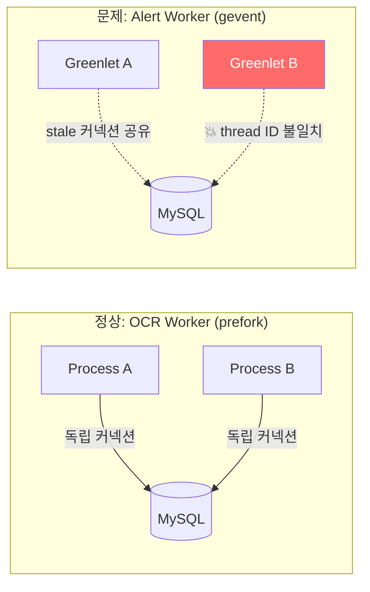
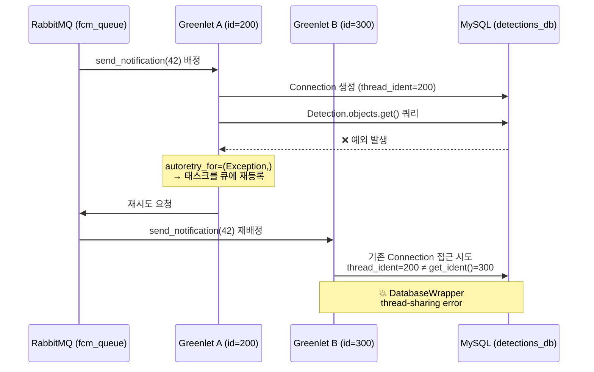
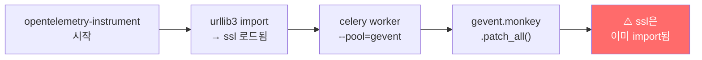
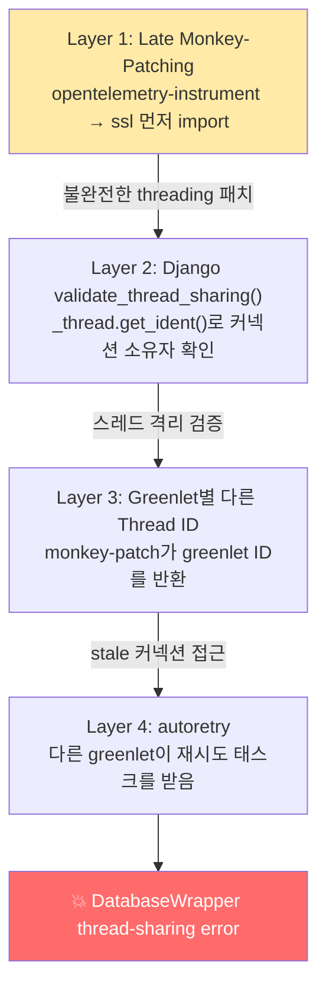
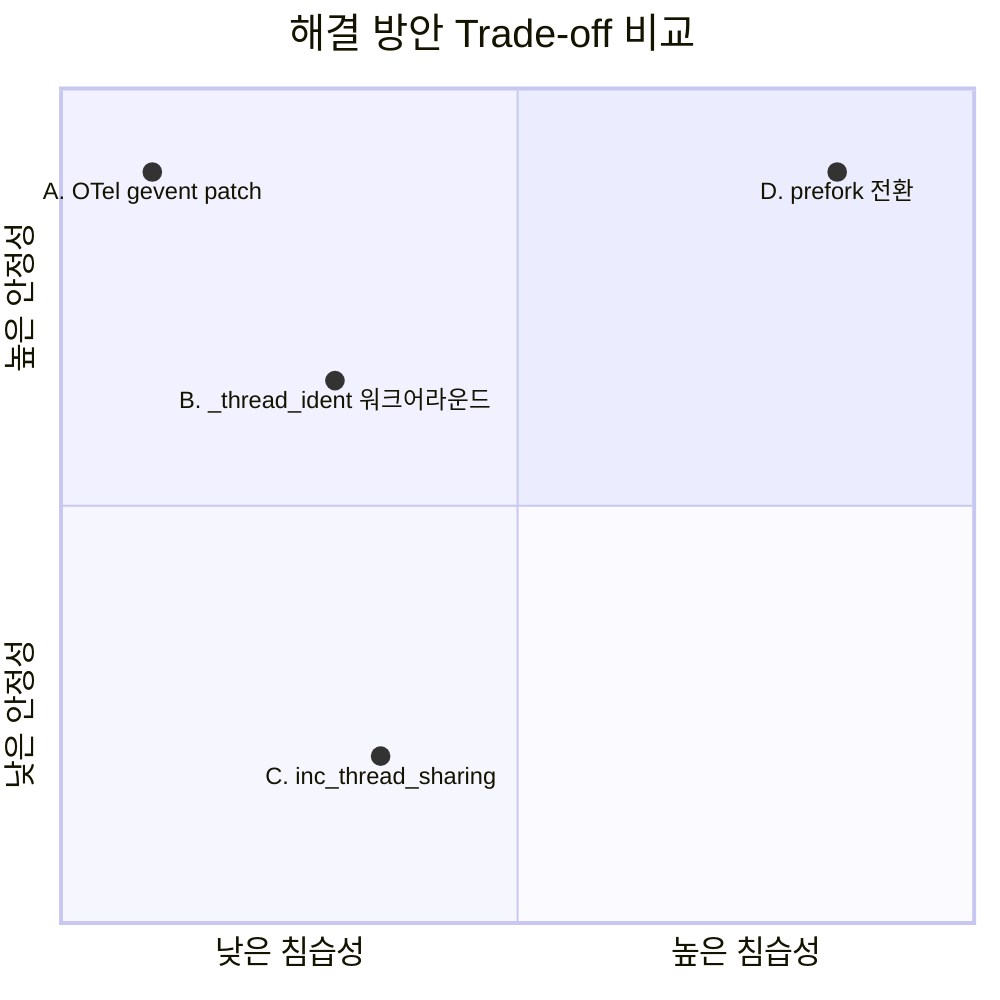

# Celery Gevent Pool에서 Django DB 커넥션이 깨지는 이유

> Celery의 gevent pool과 Django ORM을 함께 쓸 때 마주치는 `DatabaseWrapper objects created in a thread can only be used in that same thread` 에러의 원인과 해결.

> **Note (2025-02)**: Alert Worker는 현재도 Celery gevent pool을 사용한다. 따라서 이 문서에서 분석한 OTel + gevent late patching → DB thread-safety 이슈가 **현재도 유효**하며, `OTEL_PYTHON_AUTO_INSTRUMENTATION_EXPERIMENTAL_GEVENT_PATCH=patch_all` 환경변수가 필수다.

---

## Situation — 어느 날 Jaeger에서 발견한 에러

과속 감지 시스템의 알림 워커(Alert Worker)는 FCM 푸시 전송처럼 I/O 집약적인 작업을 처리한다. 네트워크 대기가 대부분이라 `--pool=gevent --concurrency=100`으로 greenlet 100개를 띄워 처리량을 극대화했다.

```bash
# scripts/start_alert_worker.sh
opentelemetry-instrument \
    --service_name speedcam-alert \
    celery -A config worker \
    --pool=gevent \
    --concurrency=${ALERT_CONCURRENCY:-100} \
    --queues=fcm_queue \
    --hostname=alert@%h \
    --loglevel=${LOG_LEVEL:-info}
```

문제는 Jaeger 트레이싱을 확인하면서 드러났다. `send_notification` 태스크에서 이런 에러가 반복되고 있었다:

```
DatabaseWrapper objects created in a thread can only be used in that same thread.
The object with alias 'detections_db' was created in thread id 35839779840
and this is thread id 35804459008.
```

> **📸 캡처 1**: Jaeger에서 `send_notification` 에러 span
> - `http://34.47.70.132:16686` → Service: `speedcam-alert`, Operation: `send_notification`
> - 에러 span 클릭 → Logs 탭의 에러 메시지 전문

혼란스러웠던 건, 로컬 개발 환경에서는 이 에러가 한 번도 발생하지 않았다는 점이다. 같은 코드, 같은 gevent pool인데 로컬에서는 멀쩡하고 GCP에 배포하니까 터졌다. 그리고 같은 프로젝트의 OCR 워커(`--pool=prefork --concurrency=4`)도 멀쩡했다. Alert 워커만 터지고 있었다.



---

## Task — 왜 greenlet에서만 터지는가

에러 메시지를 곧이곧대로 읽으면 "스레드 A가 만든 DB 커넥션을 스레드 B가 쓰려 했다"는 뜻이다. 그런데 gevent는 스레드가 아니라 greenlet을 쓴다. 문제를 풀려면 세 가지를 이해해야 했다:

1. Django가 DB 커넥션을 어떻게 격리하는지
2. gevent monkey-patching이 그 격리를 어떻게 무너뜨리는지
3. Celery의 autoretry가 왜 상황을 악화시키는지

솔직히 말하면 이 문제를 처음 마주했을 때 꽤 당황스러웠다. 나는 주로 Spring 기반으로 개발해왔기 때문에 HikariCP 같은 글로벌 커넥션 풀에 익숙했고, 런타임에 표준 라이브러리를 통째로 바꿔치는 monkey-patching이라는 개념 자체가 낯설었다. Spring에서는 Virtual Thread를 써도 커넥션 풀이 스레드와 무관하게 동작하는데, Django는 커넥션을 스레드에 바인딩한다. 이 차이를 이해하는 과정이 오히려 두 프레임워크의 동시성 모델을 더 깊이 비교할 수 있는 계기가 되었다.

---

## Action — 원인 추적과 해결

### 1단계: Django의 스레드 격리 검증

Django는 모든 DB 쿼리 실행 전에 `validate_thread_sharing()`을 호출한다:

```python
# django/db/backends/base/base.py
def validate_thread_sharing(self):
    if not (self.allow_thread_sharing
            or self._thread_ident == _thread.get_ident()):
        raise DatabaseError(
            "DatabaseWrapper objects created in a thread can only "
            "be used in that same thread."
        )
```

커넥션이 생성될 때의 `_thread.get_ident()` 값을 저장해두고, 쿼리 실행 시점의 ID와 비교한다. 다르면 즉시 예외를 던진다. 일반적인 멀티스레드 환경에서는 당연히 잘 동작한다. 각 스레드는 고유한 ID를 가지고, `threading.local()`이 스레드별 커넥션을 격리하니까.

### 2단계: gevent가 바꿔놓은 규칙

gevent의 `monkey.patch_all()`은 `_thread.get_ident()`를 패치해서 **greenlet ID를 반환**하도록 바꾼다. 즉 greenlet마다 다른 "스레드 ID"를 갖게 된다.



여기서 `autoretry_for=(Exception,)` 설정이 문제를 악화시킨다. Celery의 자동 재시도는 태스크를 큐에 다시 넣고, **다른 greenlet이 그것을 집어간다.** 이전 greenlet이 남긴 DB 커넥션에 새 greenlet이 접근하는 순간 Django의 검증에 걸린다.

> **📸 캡처 2**: Jaeger에서 retry span 관계 확인
> - `send_notification` 트레이스에서 원본 span → retry span 이어지는 타임라인

### 3단계: Late Monkey-Patching이라는 복병

워커 시작 로그를 보면 또 다른 단서가 있었다:

```
MonkeyPatchWarning: Monkey-patching ssl after ssl has already been imported
may lead to errors. Please monkey-patch earlier.
See https://github.com/gevent/gevent/issues/1016.
```

```
Exception ignored in: <function _after_fork_in_child at 0x71500038ea20>
  File "gevent/threading.py", line 264, in _after_fork_in_child
    assert len(active) == 1
AssertionError
```

> **📸 캡처 3**: Alert Worker 시작 로그
> - `docker logs speedcam-alert 2>&1 | head -20`
> - `MonkeyPatchWarning`과 `AssertionError`가 보이는 구간

원인은 실행 순서다:



gevent 공식 문서는 monkey-patching을 "가능한 한 빨리, 다른 import보다 먼저" 하라고 권고한다. 하지만 배포 환경에서는 `opentelemetry-instrument` 래퍼가 먼저 실행되면서 패치 순서가 꼬인다. 이로 인해 `threading.local()`이 greenlet-local로 완전히 패치되지 못하고, greenlet 간 DB 커넥션 격리가 무너진다.

**로컬에서 발생하지 않았던 이유가 여기에 있었다.** 로컬에서는 `celery -A config worker --pool=gevent`를 직접 실행한다. OTel 래퍼 없이 Celery가 직접 시작되므로 `monkey.patch_all()`이 충분히 일찍 호출되고, `threading.local()`이 정상적으로 greenlet-local로 패치된다. 각 greenlet이 자기만의 DB connections를 갖게 되어 스레드 ID 불일치가 일어나지 않는다. 배포 환경에서만 `opentelemetry-instrument`가 끼어들면서 패치 순서가 뒤집힌 것이다.

### 원인 요약



### 해결 방안 비교

원인을 파악했으니 해결 방안을 검토했다. 핵심은 **"어떤 비용을 감수할 것인가"**였다.

**방안 A. OTel 환경변수로 monkey-patch 순서 교정 (근본 해결)**

OTel Python 1.37.0+에서 제공하는 `OTEL_PYTHON_AUTO_INSTRUMENTATION_EXPERIMENTAL_GEVENT_PATCH=patch_all` 환경변수를 설정하면, `opentelemetry-instrument`가 자체 초기화 전에 `gevent.monkey.patch_all()`을 호출한다. 이렇게 하면 `threading.local()`이 정상적으로 greenlet-local로 패치되어, 각 greenlet이 자기만의 `db.connections`를 갖게 된다. Late patching 자체가 발생하지 않으므로 문제의 근본 원인이 제거된다.
- *Trade-off*: "experimental" 라벨이 붙어 있지만, 내부적으로는 동일한 `monkey.patch_all()` 호출 — 타이밍만 다를 뿐이다. OTel 릴리스 노트 모니터링 필요.

**방안 B. 커넥션 소유권 이전 + `db.close_old_connections()` (런타임 워크어라운드)**

태스크 시작 시 모든 DB 커넥션의 `_thread_ident`를 현재 greenlet ID로 갱신한 뒤 stale 커넥션을 닫는 방식. 동작하지만 Django의 private API(`_thread_ident`)에 의존하며, Django 업그레이드 시 깨질 수 있다. 또한 100개 greenlet이 cooperative scheduling으로 동작하므로 `close()` 시 socket I/O에서 context switch가 발생할 수 있는 잠재적 race condition이 존재한다.
- *Trade-off*: 즉시 적용 가능 vs. private API 의존 + Django 버전 종속

**방안 C. `inc_thread_sharing()` — 스레드 공유 허용**

Django가 제공하는 escape hatch. 커넥션의 스레드 검증을 끈다. 에러는 사라지지만, 여러 greenlet이 같은 물리적 DB 커넥션을 동시에 사용할 수 있게 되어 프로토콜 레벨 MySQL 오류와 데이터 정합성 위험이 생긴다.
- *Trade-off*: 에러 해소 vs. 데이터 정합성 위험

**방안 D. gevent → prefork 전환**

근본적으로 gevent를 쓰지 않으면 문제 자체가 없다. 하지만 Alert Worker는 FCM 푸시라는 I/O 바운드 작업에 특화되어 있고, prefork의 프로세스 기반 모델은 동시 100개 처리에 메모리 비효율적이다.
- *Trade-off*: 문제 근본 해결 vs. I/O 집약 워크로드에 부적합

**당시 결론: 방안 A를 채택했다.** 환경변수 한 줄로 근본 원인(late patching)을 제거하며, 애플리케이션 코드 수정이 불필요하다. `MonkeyPatchWarning` 경고도 함께 사라진다.



**수정 전 (Celery gevent pool):**
```bash
# scripts/start_alert_worker.sh
opentelemetry-instrument \
    --service_name speedcam-alert \
    celery -A config worker \
    --pool=gevent \
    --concurrency=${ALERT_CONCURRENCY:-100} \
    --queues=fcm_queue \
    --hostname=alert@%h \
    --loglevel=${LOG_LEVEL:-info}
```

**수정 후 (OTel 환경변수 추가):**
```bash
# scripts/start_alert_worker.sh

# gevent monkey-patching을 OTel 초기화 전에 수행하도록 설정
export OTEL_PYTHON_AUTO_INSTRUMENTATION_EXPERIMENTAL_GEVENT_PATCH=patch_all

opentelemetry-instrument \
    --service_name speedcam-alert \
    celery -A config worker \
    --pool=gevent \
    --concurrency=${ALERT_CONCURRENCY:-100} \
    --queues=fcm_queue \
    --hostname=alert@%h \
    --loglevel=${LOG_LEVEL:-info}
```

이 환경변수가 `opentelemetry-instrument`에게 "초기화 전에 `gevent.monkey.patch_all()`을 먼저 실행하라"고 지시한다. 패치 순서가 바로잡히면 `threading.local()`이 정상적으로 greenlet-local이 되고, Django의 `validate_thread_sharing()` 검증을 greenlet 간에도 자연스럽게 통과한다.

---

## Result — Before & After

> **📸 캡처 5**: [Before] Jaeger 에러 트레이스 목록
> - `http://34.47.70.132:16686` → Service: `speedcam-alert`
> - `send_notification` 에러(빨간색) span들이 보이는 목록

> **📸 캡처 6**: [Before] Grafana Logs Explorer
> - `http://34.47.70.132:3000` → Logs Explorer
> - Container: `speedcam-alert`, Search: `DatabaseWrapper`

> **📸 캡처 7**: [After] Jaeger 정상 트레이스
> - 수정 배포 후 `send_notification` 에러 없는 정상 span들

> **📸 캡처 8**: [After] Grafana Logs Explorer
> - 수정 후 `DatabaseWrapper` 에러 로그 없음 확인

| | Before (env var 없음) | After (env var 적용) |
|---|---|---|
| `send_notification` 에러율 | DatabaseWrapper 에러 반복 | 에러 제거 |
| `MonkeyPatchWarning` | ssl late patching 경고 발생 | 경고 제거 (정상 패치 순서) |
| DB 커넥션 격리 | greenlet 간 공유 (threading.local 미패치) | greenlet별 독립 (greenlet-local) |
| OCR Worker 영향 | 없음 (prefork pool) | 없음 (prefork pool) |
| 코드 변경 | — | 환경변수 1줄 (애플리케이션 코드 변경 없음) |

---

## References

### 공식 문서

- [Django Databases — Persistent connections and thread safety](https://docs.djangoproject.com/en/5.1/ref/databases/#persistent-database-connections)
- [Celery — Concurrency with Gevent](https://docs.celeryq.dev/en/stable/userguide/concurrency/gevent.html)
- [Gevent — Monkey Patching](http://www.gevent.org/api/gevent.monkey.html)
- [OpenTelemetry Python — Agent Configuration (gevent patch)](https://opentelemetry.io/docs/zero-code/python/configuration/)

### GitHub Issues

- [Celery #4489](https://github.com/celery/celery/issues/4489) — Workers inherit DatabaseWrapper during fork, thread ID mismatch
- [Celery #2453](https://github.com/celery/celery/issues/2453) — Celery not closing database connections properly
- [Gunicorn #879](https://github.com/benoitc/gunicorn/issues/879) — DatabaseWrapper thread error with gevent worker

### 기술 블로그

- [DoorDash Engineering — Scaling Efficiency of a Python Service with Gevent](https://doordash.engineering/2021/01/19/scaling-efficienc-of-a-python-service-with-gevent/)
- [Heroku — Python Concurrency and Database Connections](https://devcenter.heroku.com/articles/python-concurrency-and-database-connections)
- [Celery School — The Gevent Pool: 5 Lessons Learned](https://celery.school/celery-gevent-5-lessons-learned)
