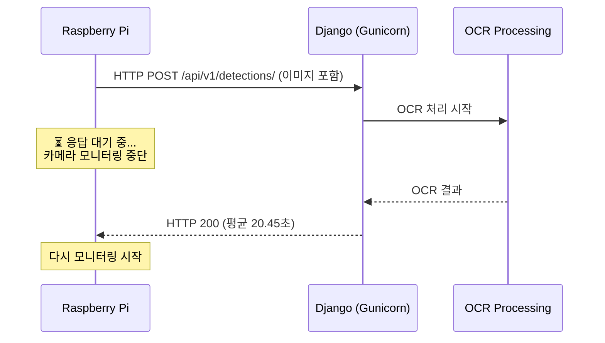
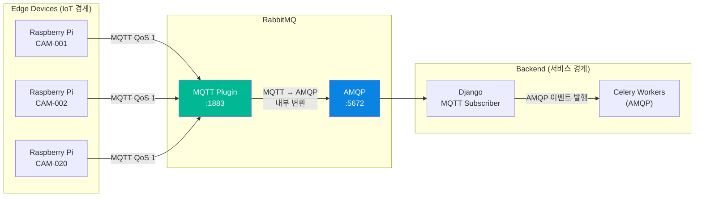
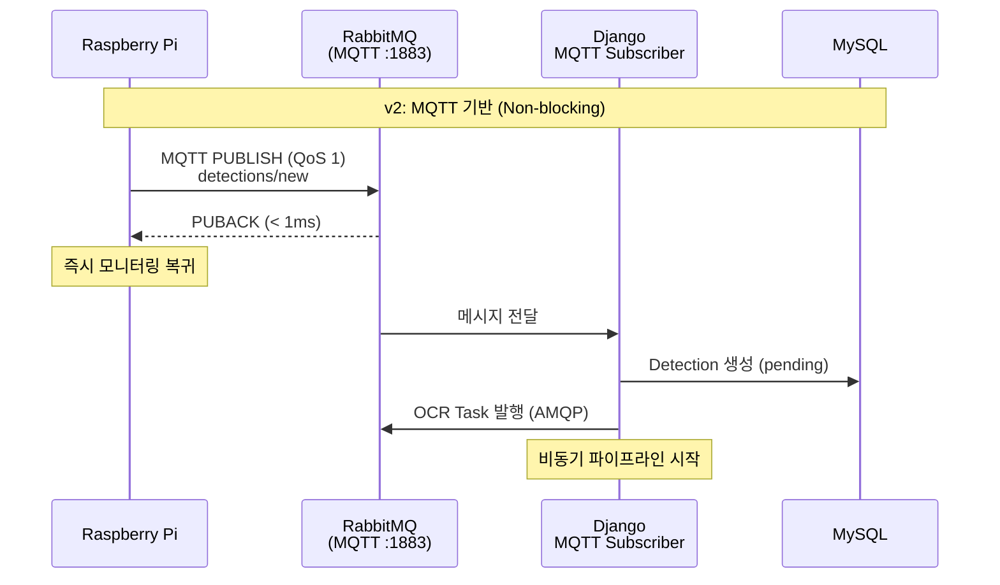
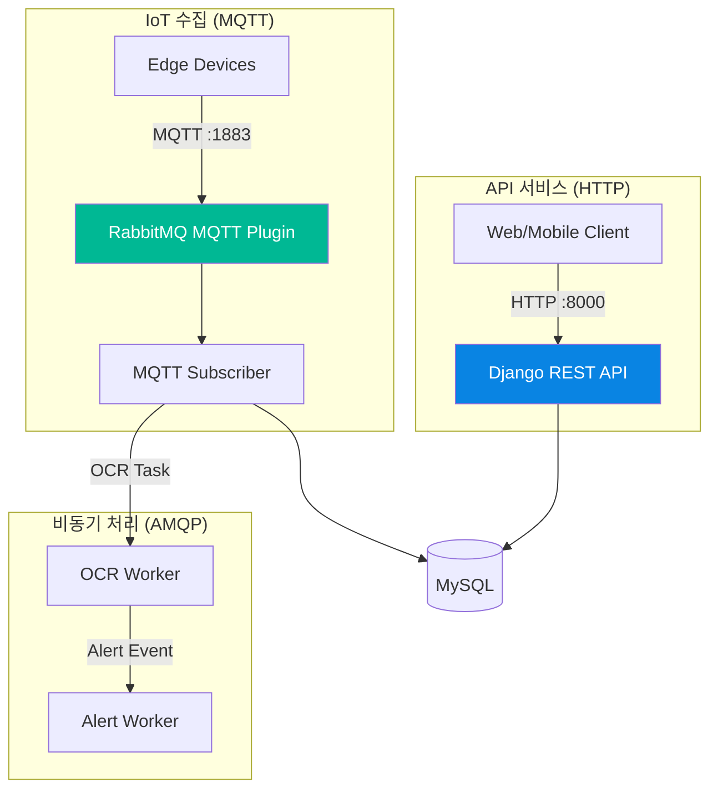

# Edge Device 통신에 HTTP 대신 MQTT를 선택한 이유

> 과속 감지 카메라(Raspberry Pi)와 백엔드 사이의 통신 프로토콜을 HTTP POST에서 MQTT로 전환한 아키텍처 결정의 배경과 결과.

> **Note (2025-02)**: 현재 시스템은 RabbitMQ MQTT Plugin(포트 1883)을 통해 Edge Device → Backend 통신을 처리한다. IoT 경계는 MQTT, 서비스 간 이벤트는 AMQP라는 **프로토콜 분리 원칙**이 적용되어 있다.

---

## Situation — v1의 HTTP 기반 통신이 만든 병목

SpeedCam v1에서 Raspberry Pi 카메라는 과속 차량을 감지하면 HTTP POST로 Django 서버에 이미지를 전송했다. 간단하고 직관적인 구조였다.



문제는 세 가지였다:

**1. Edge Device가 서버 응답을 기다리며 멈춘다.**

HTTP는 요청-응답 모델이다. Pi가 POST를 보내면 서버가 응답할 때까지 **평균 20.45초** 동안 블로킹된다. 그 사이 지나가는 과속 차량은 놓친다. 카메라가 "감지 장치"가 아니라 "업로드 장치"가 되어버린 것이다.

**2. 네트워크 불안정에 취약하다.**

과속 카메라는 터널, 고속도로 진입로, 도심 외곽 같은 곳에 설치된다. HTTP는 요청마다 TCP 3-way handshake가 필요하고, 연결이 끊기면 재전송 메커니즘이 애플리케이션 레벨에서 직접 구현해야 한다. 네트워크가 불안정할 때 데이터 유실 위험이 있었다.

**3. 프로토콜 오버헤드가 크다.**

카메라가 보내는 메시지는 실제로 작다 — camera_id, location, speed, GCS image URI 정도의 JSON이다. 그런데 HTTP는 요청마다 헤더(Content-Type, Authorization, User-Agent, ...)와 TCP 핸드셰이크를 반복한다. 20대 카메라가 각각 분당 수 건씩 보내는 구조에서 이 오버헤드는 무의미한 낭비다.

```
# v1: HTTP POST 메시지 (실제 페이로드 대비 오버헤드 큼)
POST /api/v1/detections/ HTTP/1.1
Host: speedcam-app:8000
Content-Type: application/json
Authorization: Bearer eyJ...
Content-Length: 234
Connection: keep-alive

{"camera_id": "CAM-001", "location": "서울시 강남구 테헤란로", ...}
```

---

## Task — 프로토콜 수준에서 문제를 해결해야 했다

HTTP 위에서 비동기 처리를 구현할 수도 있었다 — 예를 들어 서버가 즉시 202 Accepted를 반환하고 백그라운드로 처리하는 방식. 하지만 이것은 문제의 일부만 해결한다. 네트워크 불안정과 프로토콜 오버헤드는 그대로 남는다.

내가 필요한 프로토콜의 조건은 명확했다:

1. **Non-blocking publish**: 카메라가 메시지를 보내고 **즉시** 모니터링으로 돌아갈 수 있어야 한다
2. **QoS 보장**: 과속 위반 데이터는 **절대 유실되면 안 된다** — 프로토콜 레벨에서 전달 보장 필요
3. **Persistent connection**: 연결 한 번으로 메시지를 계속 발행 — 핸드셰이크 반복 제거
4. **경량 프로토콜**: 임베디드 디바이스(Raspberry Pi)에서도 부담 없는 오버헤드
5. **기존 인프라 호환**: 이미 RabbitMQ를 메시지 브로커로 쓰고 있으므로 별도 브로커 추가 없이 통합

---

## Action — MQTT + RabbitMQ MQTT Plugin 도입

### 왜 MQTT인가

MQTT(Message Queuing Telemetry Transport)는 IoT 환경을 위해 설계된 경량 pub/sub 프로토콜이다. IBM이 1999년 석유 파이프라인 모니터링을 위해 만들었고, 저대역폭/불안정한 네트워크에서 센서 데이터를 전송하는 것이 원래 목적이다. 우리의 "야외 카메라 → 클라우드 서버" 시나리오와 정확히 일치한다.

| 특성 | HTTP | MQTT |
|------|------|------|
| 통신 모델 | 요청-응답 (동기) | Pub/Sub (비동기) |
| 연결 방식 | 요청마다 새 연결 (또는 Keep-Alive) | 한 번 연결, 계속 유지 |
| QoS | 없음 (애플리케이션 레벨 구현) | 프로토콜 내장 (0, 1, 2) |
| 헤더 오버헤드 | 수백 바이트 | 2~5 바이트 (고정 헤더) |
| 오프라인 버퍼링 | 없음 | 브로커가 메시지 보관 |
| 양방향 통신 | 별도 구현 필요 | 기본 지원 (토픽 구독) |

### 아키텍처 설계

RabbitMQ MQTT Plugin은 MQTT 메시지를 내부적으로 AMQP로 변환한다. 이 덕분에 **새로운 브로커를 추가하지 않고** 기존 RabbitMQ 인프라 위에 MQTT 엔드포인트를 열 수 있었다.



**프로토콜 분리 원칙**: IoT 디바이스는 MQTT로만 통신하고, 백엔드 서비스 간 이벤트는 AMQP를 사용한다. 각 프로토콜이 자기 영역에서 최적으로 동작한다.

### QoS 1 선택 — "at least once delivery"

MQTT에는 세 단계의 QoS가 있다:

| QoS | 의미 | 동작 | 적합한 상황 |
|-----|------|------|-------------|
| 0 | At most once | Fire and forget | 센서 온도 등 유실 허용 |
| **1** | **At least once** | **PUBACK 확인** | **과속 위반 — 유실 불가** |
| 2 | Exactly once | 4-way handshake | 결제 등 중복 불가 |

과속 위반 데이터는 법적 근거가 되므로 **절대 유실되면 안 된다.** QoS 1은 브로커가 PUBACK을 돌려줄 때까지 클라이언트가 메시지를 보관하므로 네트워크 순단에도 데이터가 보존된다. 중복 수신 가능성은 있지만, 서버 측에서 idempotent하게 처리하면 된다(Detection 레코드의 camera_id + detected_at 조합으로 중복 감지).

### 메시지 포맷과 토픽 설계

```python
# Edge Device가 발행하는 MQTT 메시지 (Topic: detections/new, QoS 1)
{
    "camera_id": "CAM-001",
    "location": "서울시 강남구 테헤란로",
    "detected_speed": 85.3,
    "speed_limit": 60.0,
    "detected_at": "2025-02-15T14:30:22+09:00",
    "image_gcs_uri": "gs://speedcam-bucket/detections/real-plate-01.jpg"
}
```

이미지 자체를 MQTT로 보내지 않는다는 점이 중요하다. 이미지는 GCS(Google Cloud Storage)에 먼저 업로드하고, MQTT 메시지에는 GCS URI만 포함한다. MQTT 메시지를 수십 바이트 수준으로 유지하면서 이미지는 GCS의 안정적인 인프라를 활용한다.

### Django MQTT Subscriber 구현

```python
# core/mqtt/subscriber.py
class MQTTSubscriber:
    """
    Flow:
    1. Raspberry Pi -> MQTT Publish (detections/new)
    2. RabbitMQ MQTT Plugin -> 내부 변환
    3. Django MQTT Subscriber -> 메시지 수신
    4. Detection 생성 (pending) -> OCR Task 발행 (AMQP)
    """

    def __init__(self):
        self.client = mqtt.Client(
            callback_api_version=mqtt.CallbackAPIVersion.VERSION2,
            protocol=mqtt.MQTTv311,
            client_id=f"django-main-{os.getpid()}",
        )
        self.client.on_connect = self.on_connect
        self.client.on_message = self.on_message
        self.client.on_disconnect = self.on_disconnect
        self.client.username_pw_set(username, password)

    def on_connect(self, client, userdata, flags, reason_code, properties):
        """연결 시 토픽 구독 — reconnect에도 자동 재구독"""
        client.subscribe("detections/new", qos=1)

    def on_message(self, client, userdata, msg):
        """메시지 수신 → DB 레코드 생성 → OCR Task 발행"""
        payload = json.loads(msg.payload.decode())

        close_old_connections()  # 장기 실행 스레드에서 stale DB 연결 방지

        detection = Detection.objects.using("detections_db").create(
            camera_id=payload["camera_id"],
            location=payload["location"],
            detected_speed=payload["detected_speed"],
            speed_limit=payload.get("speed_limit", 60.0),
            detected_at=payload.get("detected_at"),
            image_gcs_uri=payload["image_gcs_uri"],
            status="pending",
        )

        # AMQP를 통해 OCR Worker에 태스크 발행
        process_ocr.apply_async(
            args=[detection.id],
            kwargs={"gcs_uri": payload["image_gcs_uri"]},
            queue="ocr_queue",
        )
```

`on_connect`에서 구독하는 패턴이 핵심이다. MQTT 클라이언트가 네트워크 단절 후 재연결되면 `on_connect`가 다시 호출되므로, **자동 재구독**이 보장된다. HTTP 기반이었다면 이런 복원력을 직접 구현해야 했다.

### v1 → v2 통신 흐름 비교



카메라 입장에서 PUBACK을 받는 데 걸리는 시간은 **1ms 미만**이다. 20.45초를 기다리던 것과 비교하면, 카메라는 사실상 블로킹 없이 동작한다.

---

## Result — Before & After

### MQTT 부하 테스트 결과

실제 운영 패턴을 시뮬레이션하는 부하 테스트를 설계하고 실행했다. 세 가지 시나리오로 MQTT 파이프라인의 안정성을 검증했다:

| 시나리오 | 카메라 수 | 발행 속도 | 총 메시지 | 발행 성공 | 파이프라인 완료 | DLQ 메시지 |
|----------|-----------|-----------|-----------|-----------|-----------------|------------|
| normal (0.33 msg/s) | 20대 | 1건/분 | 40 | 100% | 100% | 0 |
| rush_hour (1.67 msg/s) | 20대 | 5건/분 | 200 | 100% | 100% | 0 |
| burst (10 msg/s) | 10대 | 1건/초 | 600 | 100% | 100% (157초) | 0 |

> **📸 캡처 1**: Grafana - MQTT 부하테스트 burst 시나리오 대시보드
> - `http://34.47.70.132:3000` → SpeedCam Dashboard
> - 발행 속도 10 msg/s 구간에서 OCR 큐 깊이 변화와 완료율 추이

> **📸 캡처 2**: RabbitMQ Management - MQTT 연결 및 큐 상태
> - `http://34.64.183.199:15672` → Connections 탭 (MQTT 연결 목록)
> - Queues 탭 (ocr_queue, fcm_queue, dlq_queue 깊이)

burst 시나리오가 특히 의미 있다. 60초 동안 600건의 메시지가 밀려들어도 **단 한 건의 유실 없이** 모든 메시지가 파이프라인을 완주했다. DLQ(Dead Letter Queue) 메시지 0건은 재시도 실패도 없었다는 뜻이다.

### Before & After 비교

| | Before (v1: HTTP POST) | After (v2: MQTT) |
|---|---|---|
| Edge → Server 지연 | 평균 20.45초 (응답 대기) | < 1ms (PUBACK) |
| 카메라 상태 | 업로드 중 모니터링 중단 | 즉시 모니터링 복귀 |
| 네트워크 복원력 | 없음 (요청 실패 시 유실) | QoS 1 — 브로커가 전달 보장 |
| 연결 방식 | 요청마다 TCP 핸드셰이크 | Persistent connection (1회 연결) |
| 프로토콜 오버헤드 | 수백 바이트 HTTP 헤더 | 2~5 바이트 고정 헤더 |
| 오프라인 내성 | 없음 | 브로커가 메시지 보관 (QoS 1) |
| 추가 인프라 | — | 없음 (RabbitMQ MQTT Plugin 활성화만) |
| burst 처리 (600건/60초) | 서버 과부하 위험 | 100% 전달, 0 유실 |

> **📸 캡처 3**: Grafana - v1 HTTP 기반 Detection 생성 시간
> - `http://34.47.70.132:3000` → HTTP API Response Time 패널
> - 평균 20.45초 응답 시간이 보이는 구간

> **📸 캡처 4**: Grafana - v2 MQTT 기반 Detection 생성 시간
> - `http://34.47.70.132:3000` → MQTT Pipeline Latency 패널
> - MQTT PUBLISH → Detection(pending) 생성까지의 지연 시간

### 프로토콜 분리가 만든 구조적 이점

MQTT 도입으로 얻은 것은 단순히 속도 개선만이 아니다. **IoT 수집과 HTTP API의 관심사가 분리**되었다.



MQTT Subscriber가 다운되어도 HTTP API는 영향 없이 동작한다. 반대로 API에 트래픽이 몰려도 MQTT 메시지 수신은 독립적으로 처리된다. 각 경로가 서로의 장애에 격리된 구조다.

---

## References

### 공식 문서

- [MQTT v3.1.1 Specification (OASIS Standard)](http://docs.oasis-open.org/mqtt/mqtt/v3.1.1/os/mqtt-v3.1.1-os.html)
- [RabbitMQ MQTT Plugin](https://www.rabbitmq.com/docs/mqtt)
- [Eclipse Paho MQTT Python Client](https://eclipse.dev/paho/files/paho.mqtt.python/html/client.html)
- [Django Management Commands](https://docs.djangoproject.com/en/5.1/howto/custom-management-commands/)

### 기술 참고

- [MQTT vs HTTP for IoT — HiveMQ](https://www.hivemq.com/blog/mqtt-vs-http-protocols-in-iot-iiot/)
- [MQTT QoS Levels Explained — HiveMQ](https://www.hivemq.com/blog/mqtt-essentials-part-6-mqtt-quality-of-service-levels/)
- [RabbitMQ as an MQTT Broker — CloudAMQP](https://www.cloudamqp.com/blog/rabbitmq-mqtt.html)
- [Designing IoT Architectures with MQTT — AWS IoT](https://docs.aws.amazon.com/iot/latest/developerguide/mqtt.html)
